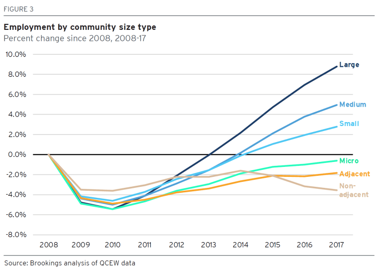

\newpage

# Introduction

## Regional Inequality and Divergence in the United States

When the Brookings Institution [@galston2018] un-ironically uses the phrase "uneven development." you know that something has gone seriously wrong. 

## Motivation

*The real world: There is a housing crisis in the United States. But also, real
estate is under-theorized, and also, a study of inequality needs to take space
into account*

This disssertation is about space--It is about the ways in which growth,
distribution, and inequality are organized spatially. And, as @lefebvre2003
argues, "the urban" has become a generalized condition of the current era of
capitalism, so any investigation into the spatial structure of economic
processes should properly be urban in orientation. 

The first two chapters of this dissertation concern themselves with the
political economy of real estate. I choose landed property as an entry point
because land, housing, and real property form the material anchor of all
networks of consuption and production. Accordingly, both the physical structure
of the built environment and the material reality of growth and distribution
are intimately linked with land and housing. The final chapter takes
a firm-level approach to regional inequality, examining the effects of
decisions made by firms and by cities on the regional distribution of income
and opportunity.

Chapter 1 is motivated by the spatial crisis gripping American cities. I use
the term "spatial" here because, despite my primary focus on the real estate
sector, I believe that the crisis in the housing sector in individual cities is
linked to wider patterns of increasing inequality at larger scales (i.e.,
inter-urban and inter-regional). The chapter begins with some descriptive statistics regarding homeownership and rentership, and the current crisis of affordability and access in American cities. 

## Contribution to the Literature

*This dissertation contributes to: A systematic analysis of scale as applied to
the American regional economy, a contextualization of real estate in terms of
broader economic processes, an analysis of the roles of space, scale, and
property relations in the propagation of economic inequality.*

## General Framework 

*My approach combines the Scale-Network framework of @jessop2008, the classical
political economy approaches of @george2015 and @engels1872, and the heterodox
macroeconomic analysis of @shaikh2016. I argue that the mainstream general
equilibrium approach fails on multiple fronts; specifically, they ignore the
structure of class and racial power, they ignore the role of the state in
structuring urban space and inequality, and they are unable to account for the
scale of economic processes.*

# What Do Landlords Do? The Political Economy of Real Estate

**Research Question:** *How do we account for the role of landed property
owners and developers in urban growth and distribution?*

## Abstract

This chapter explores the dynamics of the real estate sector in the American
economy in the context of regional inequality. The dominant view of the rise in
housing prices and land rents is that they arise from restrictions on the
supply of housing in high-growth regions of the country [@glaeser2008;
@ganong2017; @hsieh2015a], colloquially known as NIMBYism, which assign
locational rents to current homeowners at the expense of those wishing to
migrate. The policy implication that immediately follows is that the
deregulation of markets for land and housing will result in an increase in
affordability of and access. In this chapter, I intend to show that this
explanation falls short as 1) relies on the existence of a perfectly
competitive market in land and structures, and 2) does not take into account
factors of governance and bargaining power.

I construct an alternate theoretical view of the role of real estate
development based on the classical rent theories of Engels [-@engels1872;
-@engels2009], George [-@george2015], and Harvey [-@harvey2018a] to argue that
the increase in rents (expressed as rent-income ratios) are due to an increase
in the bargaining power of property developers and large landowners resulting
from stagnation and decline in the productive sector [@dymski2010a]. I use this
framework to analyze the dynamics of the real estate sector and its
distributional consequences in three American cities: New Haven, CT, San
Francisco, CA, and New York, NY. 

## Introduction

As @stein2019 writes:

>The force behind these trends is the growing centrality of urban real estate
to capital’s global growth strategy. The price of land becomes a central
economic determinate and a dominant political issue,” Stein wrote. “The clunky
term ‘gentrification’ becomes a household word and displacement an everyday
fact of life. Housing becomes a globally traded financial asset, creating the
conditions for synchronized bubbles and crashes. 

>Landed property has nothing to do with the actual process of production. Its role is confined to the transferring a portion of the produced surplus value from the pockets of capital to its own. However, the landlord plays a role in the capitalist process of production... because he appeares as the personification of one of the most essential conditions of production. @marx1991

>It is no accident that land is called real estate. For many centuries the ownership of land has been not
just the main but often the only sure basis of power. @jackson1985

## Methodology

### Notes

1. Vacancy rate began to rise in 1980s. @sclar2018 notes the contradiction between capital gains and rental income from the perspective of the property developer.

2. Upzoning *increases* property values and potential rent. So how can NIMBYism exist, rationally? 

## Literature Review

### Current Literature on Rents, Regulation, and Real Estate

### Classical Approaches to Land Rent and Property Income

* @marx1991, @harvey2018a, @ball1977 - Differential rent 

* @engels2009; @engels1872, @ball2016, @obeng-odoom2016 - Political economy of land ownership and urban growth

# On the Housing Question: Real Estate and Inequality

**Research Question:** *Are increasing monopoly returns in the real estate sector responsible for the growth in regional inequality?*

## Abstract

## Introduction

The theoretical approach developed in Chapter 2 generates a number of empirical predictions at both the national and regional levels:

1. In the face of negative productivity shocks, investment in real estate will tend to increase

2. In regions experiencing higher growth, relatively greater shares of income will accrue to holders of landed property

3. Monopoly rents are causally prior to zoning changes

4. Deregulation of housing markets will have the effect of *exacerbating* regional inequality, rather than relieving them

    * Is there an interaction effect? What happens when some cities deregulate and others don't? This is a question about migration

    * What happens to small homeowners? It may be the case that zoning restrictions are a defense of small homeowners vs. large property developers

5. Real estate markets will become more monopolized over time

# Superstar Firms and Locational Rents: the HQ Game

Research Question: *Do large firms extract rents from cities through the threat of entry/exit?*

## Abstract

Recent research in labor economics has focused on the role of superstar firms as drivers of income inequality in the united states [@autor2017]. This literature has largely focused on the ability of large, vertically-integrated firms to generate greater-than-average labor productivity by capturing market share out of proportion to the firm's size, and thus increasing revenue per worker. This essay explores the distributional effects of a different channel: the extraction of public payments from local governments. 

I argue that in the period of neoliberal urbanism, structural changes in the financing of urban development have increased the bargaining power of large and mobile monopoly firms with respect to municipal governments. This forces cities to compete with each other to offer rents in the form of tax abatements and public subsidies, with the offer being proportional to the amount of market power a particular firm has. 

I use a data set on public payments to corporations combined with geographic data on the location and concentrations of firms and industries to show that public subsidies have very little effect on income growth and distribution in particular regions. I then model the bargaining problem for cities and show that they are trapped in a "race to the bottom," in which the equilibrium outcome is for urban governments to offer higher and higher incentives to induce (or oppose) the relocation of superstar firms. 

## Introduction

## Literature Review

### Structural Change and Neoliberal Urbanism

* @swyngedouw2004a - "Glocalization;" shifting of municipal finance from local and national to global scales, shifting of industrial organization from local to global scale

* @jessop2008 - framework for analyzing networks and processes in different scalar contexts

### Superstar Firms 

* @autor2013, @reenen2018, @giannone2017

### Firm Location Decisions

* @glaeser2014a - Neoclassical location theory

## Descriptive Statistics

1. Following @autor2017, I assemble a dataset that ranks firms with publicly-available data based on productivity per worker and sort them into deciles. I use this to identify "superstar" firms, and geocode them to obtain a spatial database of firm locations. 

2. The non-profit organization Good Jobs First has assembled a database of public subsidies to corporations. I can match these to the superstar firms determined in (1), and derive an indicator that measures the relationship between public subsidy and productivity. By combining both datasets into a single map that tracks location changes and subsidies over time, I can map the relationship between public subsidies and firm location choice. I hypothesize that there is a causal relationship between a firm's productivity differential (relative to the industry mean) and the amount of subsidy it is able to extract. 

3. For a small subset of superstar firms in tech and pharma, I examine archival data on the history of their location changes to examine the underlying political decision to accept or reject on the *city's* side.

## A Model: the HQ Game

# Conclusion

# References

