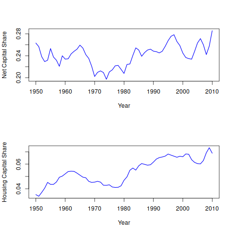
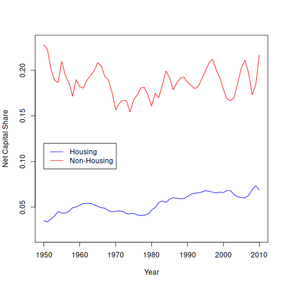

\\newpage

# Introduction

Regional inequality has become a topic of considerable importance since the
Great Financial Crisis. Much of the recent literature in labor and urban
economics has been on the subject of "superstar cities;" the phenomenon where
the largest cities undergo rapid growth in income and employment, while smaller
ones stagnate and decline.

A major focus of the theoretical and empirical literature has been on the
skill-sorting of cities, with skill-biased technical change driving
in-migration of skilled labor and rising costs driving out-migration of
lower-skilled workers into depressed suburbs and smaller cities.

The rise of superstar cities has led to a consequent crisis of housing in
_all_ cities of the United States, with increases in homelessness and
declines in homeownership and affordability across-the-board, but
especially in urban centers of the most productive city-regions.
Inter-city inequality becomes reproduced as intra-city inequality, as land
values in cities featuring the most growth becomes prohibitively expensive
to own or rent, and zoning for density results in the growth of high-rent
housing stock instead of providing for mixed-income neighborhoods.

Much of the recent literature on the relationship between housing and regional
growth focuses on the elasticity of the housing supply with respect to housing
regulations, particularly zoning. Though the theoretical result is relatively
straightforward (tight housing regulations cause high land rents, leading to
skill sorting), empirical support for this conclusion has been somewhat
ambiguous. Relaxation of the political constraints on zoning may [@hsieh2019]
or may not [@freemark2019] have led to a decrease in the cost of housing.

I focus on the role that distributive conflict plays in the creation of urban
space and inequality. @rognlie2015 uses NIPA data to show that the decline in
the labor share during the past 30 years seems to be due to an increase in the
share going to housing capital, rather than corporate capital (See figures 1 and 2). 
Similar shifts in the distribution of income can be seen in breakdowns of GDP by metropolitan
areas. It is also clear that housing prices and rents have risen rapidly over
the same period, in a geographically uneven fashion. The implications of
extreme variances in housing costs are widespread; @chetty2014 and
@derenoncourt show that there are place-based effects to human capital
mobility, and that high housing costs can lock low-income people out of
high-mobility areas.

The mainstream urban economics and inequality literature generally agree that
the housing crisis is largely the result of government failure; zoning laws in
a particular locale are voted on by constituencies containing incumbent
landowners, in whose interest it is to keep growth in the housing stock as low
as possible. Those who would benefit from housing expansion, i.e. potential
emigrants, obviously cannot vote to influence zoning laws in another city. This
leads to low-skilled workers being "trapped" in low-productivity cities that
sort by skill-biased technical change [@ganong2017].

Much of this literature relies on the spatial equilibrium approach begun by Von
Thunen, and assume perfectly competitive markets for land, housing and
construction. If this were the case, then divergence between housing prices and
construction costs would be an indication of government failure
[@glaeser2005b]. However, the spatial equilibrium approach has real trouble
dealing with issues of scale; for example, a construction firm equipped to
build in a dense urban region must be considerably more sophisticated and
capital-intensive than a firm building in small outlying towns.

In addition, @knoll2014 find that  87% of shifts in housing prices in the
United States in the last century can attributed to changes in the price of
land, rather than housing or other land improvements. So it is unclear whether
we can attribute prices in excess of marginal costs solely to regulation or to
other factors, such as monopolization or returns to scale. In this
dissertation, I use a political economy approach to focus on residential real
estate; in particular on distributions between wages, profits, and rents, and
the way that the struggles over that distribution plays out over geographic
space. I intend to use a variety of approaches, including theoretical argument,
historical/descriptive analysis, and econometric analysis.

## General Literature Review

[10 sources]

@lefebvre2003

@harvey2018a

# On The Housing Question

**Research Question: What are the conditions under which increases in
income are captured by landlords? Who gains from a relaxation of building
restrictions?**

## Introduction

This is a theoretical essay on the distributional role of real estate in the
urban context. I begin with macro data from @rognlie2015, showing that over the
past 30 years, the decline in the labor share can be attributed to increases in
income going to housing, in contravention of Kaldor's stylized facts of growth.
When looking at metropolitan GDP and housing figures, a few results emerge:

1.  The share of of regional GDP going to real estate is increasing, even in
    cities where real estate is not the primary industry

2.  Rent-income ratios in the most productive cities have risen rapidly

3.  The construction of new housing has experienced a secular decline,
    especially within cities with the fastest income growth

4.  The composition of new housing construction has changed, reflecting
    declining homeownership and increased rentership.

In this paper, I build an argument incorporating the critical geography
and urban economics traditions. I develop general theoretical questions
regarding the role of differential rents, economies of scale, and the
level of homeownership, and show that under certain conditions, all of the
income growth in a particular region can be captured by landlords, and
that in equilibrium, urban land markets under conditions of increasing
returns may not clear. The first half of this paper will be a survey of
the history of economic thought regarding landlords, rents, and cities,
and the second will consist of a formal presentation of the theoretical
argument.

## Literature Review

[10 sources here]

@engels1872

@aalbers2014

@harvey1974

@harvey2018a

@ryan-collins2017

@glaeser2009a

@glaeser2014a

### The Classics

#### Marx & Engels

Marx deals with ground-rent in _Capital, Vol. III_. This is done primarily in
the context of agricultural production, though it forms the basis for the
analysis of urban property ownership by Engels and later geographers and
economists. He begins with the classical political economy premise that "landed
property is based on the monopoly by certain persons over definite portions of
the globe, as exclusive spheres of their private will to the exclusion of all
others." Under capitalist relations, the relationship between the landlord and
the industrial capitalist "...totally separates land an instrument of
production from landed property and landowner-- _for whom the land merely
represents a certain money assessment which he collects by virtue of his
monopoly from the industrial capitalist_, the capitalist farmer..." (emphasis
mine). In other words, land becomes an expression of monetary value, which
represents a claim on the production generated by the capitalist (whether
agrarian or industrial), by virtue of the institution of private property--
ownership of the land represents a _claim_ on the _future productivity_ of that
land.

This framework has been developed in several ways, particularly by
@harvey2018a, addressed below, and @basu2018. Basu points out that the key
to the Marxian (neo-Ricardian?) understanding of land rents in general is
that "if the non-produced resource is privately owner, and is limited in
quantity, then its owner appropriates an income stream that we call
capitalist rent," and applies the dynamics of ground-rent to _all_
non-produced resources. Since non-produced resources do not require labor,
by definition, then they have no _value_ in the Marxian sense. However,
they do have _prices_, despite having no value.

@engels2009 provided the first Marxian analysis of particularly the
_housing_ question under urban capitalism, starting from the vantage point
of the English working class. For Engels, "the housing question relates to
problems of quantity (shortage), accessibility/distribution, quality, and
affordability. He argued that the conditions of housing at every time
should be considered as part of, not separate from, broader economic,
social, and political processes," [@obeng-odoom2016]. In other words,
housing dynamics cannot be understood as processes separate from labor
market (and, later, financial market) dynamics. The landlord, as private
owner of housing, uses the threat of homelessness as a means to extract
value from the tenant. This relationship is slightly different than the
extraction of surplus value from the tenant farmer in agriculture- in this
case, the surplus value is produced in the productive (corporate) sector,
and the relative power of landowners, workers, and capitalists determine
the resulting distribution of rents, wages, and profits between them.

The key theoretical points that I wish to draw from Marx and Engels is
that land rents are the site of distributional conflicts between
landlords, peasants, and workers (in agriculture), and between landlords,
workers, and capitalists (in industry). More importantly, the
landlord-tenant relationship in urban capitalism is in actuality the site
of multiple forms of contested exchange operating at different scales.
This is a point elaborated on by the Marxist Critical Geography school,
which I address further below.

#### Henry George

While Marx focused on the relationship between Labor and Capital in
relatively land-scarce Europe, Henry George directed his analysis against
the relationship between Labor and Land in the land-abundant United
States. George held that, as against the work of the laborer and the
self-discipline of the capitalist, rent on bare land could increase solely
through public investment into infrastructure and amenities, or through
natural population growth, encouraging rampant land speculation. At the
time, land interests were perceived as holding back the rapid
industrialization of the United States. Mirroring the American
Transcendentalists of his day, he held that land should either be held in
common by all people, as "an endowment from God," [@george2015], or (not
so much like the Transcendentalists), the entire value of bare land should
be taxed away and used for public investment. The Land Value Tax
still remains wildly popular among economists as a way to combat land
speculation; while briefly touched on later in this chapter, a full
discussion of the LVT is beyond the scope of this dissertation.
Abstracting from the uniquely American yeoman ethics of _Progress and
Poverty_, the major Georgist theoretical points important to my argument are as
follows:

1.  _Private ownership of land grants monopoly power over that plot of
    land, which is part of an absolutely fixed supply._ The somewhat
    bizarre nature of land _vis a vis_ other commodities was also noted by
    the other classical economists (especially Ricardo). This grants
    landowners as a class short-side power over any process that requires
    space (e.g., literally every process), and the power to extract rents
    over the use of that land in proportion to how necessary and/or
    valuable that land becomes-- for example, landowners who speculated on
    the future paths of railroad tracks and depots^[or, for a more modern
    example, the purchase of plots of land along the U.S.-Mexico border by
    the founders of Cards Against Humanity, for the purpose of halting
    President Donald Trump's border wall. In fact, this type use of monopoly
    power by landlords was so troublesome to the public good, the power of
    eminent domain was enshrined into the U.S. Constitution under the Fifth
    Amendment. From a kind of Jeffersonian libertarian outlook, this is a rather
    shocking (and telling) violation of the "inviolable" right to
    property.]. This idea remains salient (perhaps even more so) during the
    contemporary period of urban development where economies of scale and
    agglomeration in cities dictate the degree of _locational monopoly_
    a particular landlord is able to exercise.

2.  _The value of bare land (i.e., absent any improvements such as
    structures, etc.) is determined by forces outside of any individual
    landowner's control._ In other words, the landlord realizes both
    a capital gain and an increase in potential rent when a location
    becomes desirable, without any action on his or her own part. George
    saw this as something morally abhorrent, but we can also see that
    a raise in rents due to a change in locational advantage is a pure
    redistribution away from other, productive sectors of the economy.

Further, on point (2): The Henry George Theorem^[in its general form
(Arnott 2004): "in any constrained Pareto optimal and nontrivial allocation of
population in a spatial economy, the aggregate shadow losses from increasing
returns to scale activities just equal the aggregate shadow profits from the
decreasing returns to scale activities."], first formalized by @arnott1979, is
now a staple of public finance. It shows that, under certain conditions,
aggregate spending on public goods will increase aggregate rent based on land
value by at least that amount, thereby leading to calculations of optimal city
sizes, among other things. Technical discussion of the HGT and its implications
are beyond the scope of this essay, but the salient point I wish to focus on is
that the theorem highlights the _externality_ problem facing urban planners and
would-be city dwellers: each landlord's absolute control over their own
personal fiefdom allows them to accrue external benefits from both public and
private actions undertaken outside their property. In modern cities, with very
powerful agglomeration effects, these externalities could grow to be quite
large, as density increases. This potentially points to increasingly severe
coordination failures in housing supply.

In sum, the theoretical lines I wish to draw from Henry George are towards
**the monopoly pricing power over land**, and **positive externalities as
a result of density, scale, and agglomeration.**

#### David Harvey

@harvey2018a; @harvey1974 provides a further elaboration on theories of
rent put forth by Marx in Vol. II and III of _Capital._ He separates land
rent into absolute rent and differential rent, and crucially, places them
within the context of space and financial capital. For Harvey, the
fundamental tension within capitalism is:

> The logic of capital accumulation produces fixities (the built
> environment), but as soon as the built environment comes into existence,
> they become barriers to the circulation of capital."

In other words, at the moment that circulating capital becomes fixed in
space, they become long-lived checks on the flow of that capital back into
the economy, and the engine of capital accumulation is driven by constant
reduction of turnover time required to transform value into surplus value,
or "the annihilation of space by time."

The built environment comprises a secondary circuit of capital, which
tends to attract surplus capital from the primary circuit. This arises due
to the lack of immediate profitability in the primary circuit^[which
brings to mind the question: what happens to the secondary circuit during
periods of expansion in the primary? We might imagine that this would
cause under-accumulation in something like the housing sector], and cycles
in the built environment seem to be related to cyclical crises in the
primary circuit.

Absolute rent, in Ricardian form, is simply rent that is accrued due to the scarcity of a particular resource; differential rent is rent based on the differential productivity of land. To this, Harvey adds DRII, or "monopoly" rent, which is a _spatial rent created through power_, whether this be state power, class power, etc. Harvey uses the term "class monopoly rents" to specify a type of class power that raises the _absolute_ rent that can be extracted from a resource; in essence, landlords and developers use class power to create artificial scarcity in order to drive up the slice of surplus value (George's "unearned increment") that can be
 extracted from the productive sector.

#### Jane Jacobs

#### Chicago School of Sociology & Neoclassical Spatial Equilibrium

### Overview of the Housing Question under Urban Capitalism

Based on this survey of the theoretical literature, we can see that the
land prices, rents, and the spatial structure of housing markets are the
outcome of several idiosyncratic and contradictory process that operate at
multiple levels. Starting from the level of the household:

1.  The **household level** is where the reproduction of labor-power occurs.
    The housing _unit_ can be considered both a capital good, used in the
    production of housing services, and a wage good, itself being the
    object of consumption. In the Marxian sense, we can also consider the
    household as the site of the production of labor-power. Real estate in
    general is required as an input to the production of _any_ commodity,
    since the production process necessarily exists in physical space as
    well as time. Like other capital goods, it is subject to
    depreciation. The housing unit sits on a plot of land, which
    contributes to consumption of housing services, but beyond that its
    market value (i.e., exchange value) is determined solely by external
    (i.e., locational) factors-- housing tends to depreciate, while land
    values tend to appreciate. Consequently, homeownership grants the
    household increases in consumption ability by way of capital gains and
    access to credit due to the ownership of physical collateral.

2.  The landlord-tenant relationship can be characterized as one of
    contested exchange. The landlord charges some fraction of the tenant's
    wage for the privilege of not being homeless. The particular amount
    that the landlord can extract depends on several factors; chief among
    these is the amount of other rental housing (the quantity of which
    forms the basis of Harvey's class monopoly rent) within a commutable
    radius of the tenant's workplace, and the strength or weakness of legal
    tenant protections, among others. The existence of
    owner-occupied housing serves as an important outside option, and on
    this view we should expect rent-income ratios in a particular city to
    move in opposite directions as the rate of homeownership.

3.  At the **urban scale**, the landlord-tenant-homeowner relationship is
    embedded in the networks comprising urban capitalism. Specifically,
    rental payments to the landlord are out of wages paid by the corporate
    capitalist sector. We can conceive here of a tripartite distributional
    conflict in which the worker, capitalist, and landlord struggle for
    a share of output, with each class' share depends on the relative power
    for each. If high rents lead to higher wage demands, then capitalist
    firms may intervene directly in the housing market, as in company towns
    in the mining and lumber industries, or the planned housing investments
    in Seattle by Amazon or in the Bay Area by Google [@sisson2019].

    Local governments, the most directly involved in land and housing
    markets in the United States, also act at the urban scale. The state
    implements zoning restrictions, issues building permits, enacts rent
    controls, and other direct interventions into the built environment. We
    can consider local regulations governing residential and commercial real
    estate as a political equilibrium that is contested not only by the
    incumbent voting population, but various other agents and multiple
    scales (for example, financial institutions via the municipal bond
    market, detailed below). In the U.S. context, municipal financing is
    done primarily through property taxes, which gives urban governments
    strong incentives to promote growth in property values when faced with
    fiscal pressure [@stein2019].

4.  In the U.S. urban context, the **state scale** has something of
    a second-order importance; state governments, for example, serve as
    battlegrounds between large urban conglomerations and the suburban-rural
    populations that reside within the state. This is also the scale at which
    large capitalist firms, including real estate firms, indirectly affect the
    built environment for a particular city-- the most salient methods for the
    purpose of this dissertation is through tax incentive schemes for firm
    relocation and through the pre-emption of local real estate regulations^[for
    example, the wave of anti-rent control legislation that swept through many
    state legislatures during the 1990s. In many cases, rent control was
    exceedingly popular at the local level, where the majority of the electorate
    were renters. By adjudicating the conflict at the state level, with higher
    barriers to political action, landlords and developers are able to bypass
    stakeholders who would otherwise be opposed.].

[to be completed later]

## Land Rents and Urban Growth

[Main body of the essay. Will talk about speculator-developers, owner-occupancy
as outside option]

## Conclusion and Further areas for study

# The Real Estate State: Housing in the Bay Area

**Research Question: How much of an increase in e.g. regional growth goes to landlords?**

## Introduction

This is a historical/empirical essay that builds on the theoretical arguments
developed in the previous chapter. The historical portion of this chapter
focuses on the political and legislative development of the real estate
industry during the growth of the technology industry starting in the 1990s.
This period can be split into an early period, featuring relatively high
elasticities of housing supply, and a late period, featuring relatively low
elasticity of supply. The empirical methodology builds on @agarwal2019, who
found that increases in the Philadelphia minimum wage had been largely absorbed
into higher rents. I show that, following the argument in the previous chapter,
changes in the (regulatory environment/size of property developers/etc) in the
late period caused the same to be true for _general_ increases in income (in
other words; high productivity in spatially-concentrated industry turned higher
wages into transfer payments from employers to landlords).

## Literature Review

[10 sources here]

## A History of Bay Area Real Estate

[Neighborhood development before and after GFC, including major court cases,
major developments, tenant/owner fights, something similar to ]

## Data and Methodology

Bay Area cities should have relatively well-established data on land prices and
rents. I need to think of a specification to show what happens to rents when
the average (median) income of a neighborhood increases, to control for
increased demand and migration. If I had the _perfect_ data set, it would
include:

-   Median incomes for renters in a particular location,

-   Rents for those particular locations

-   Housing units, owner-occupied vs. rented over the time period

-   Number of building permits issued in the location

I should be able to similarly use a DID approach. Where @agarwal2019 used
lease-agreements as a proxy for minimum wage-earners' budget constraints,
I would have to find a different dependent variable. The equation to be
estimated would be something like:

$$ \\Delta rent_i = \\Beta_1 \\Delta medianwage_i + \\gamma controls $$

Where I could compare those neighborhoods/metro areas that had the features
identified in chapter 1 to those that did not.

## Results and Conclusion

# Rent Control-- Is it Good, Actually?

## Introduction

One need only to mention the phrase "rent control" to an economist to hear the
reflexive Lindbeck quote about aerial bombardment, accompanied by a radioactive
level of smugness. Rent control is considered as solved a problem as any, with
the consensus of the entire discipline holding that rent control is as wasteful
as any price control, resulting the lower housing quality, housing shortages,
and paradoxically higher rents (e.g. @diamond2018). Yet, despite this, in the
face of spiralling housing costs in many of the metro areas of the USA, many
municipalities are calling for (and enacting) rent control legislation.

In a distributive-conflict framework, residential rent is a payment that
a landlord extracts from a tenant through the threat of displacement via
eviction. Rent control provides a check on this ability, and _does_ reduce the
net-present-value of the rental property. Landlords can respond by taking
rental housing off the market (by, for example, becoming owner-occupants or
converting properties to a non-controlled type), eviction-through-harassment,
or simply by buying out the tenant. Such cases may be easily rectified through
appropriate legislation or strengthening tenant protections.

[Move to next section]

> In this paper, I use data from @chetty2014 to evaluate whether rent control is
> a viable strategy to preserve neighborhood access to public amenities that
> increase economic mobility. In other words, rent controls may be
> welfare-increasing _even if they result in higher rents and lower housing
> supply overall_ if they preserve the access to place-based institutions that
> allow for mobility.

## Literature Review

### Empirical Studies on Rent Control

@diamond2018 provides the most recent well-identified empirical analysis
of rent control, and is the closest in methodology and substance to this
essay. They use private datasets from DataQuick and Infutor. The
combined datasets allowed them to link the identities of any resident of
San Francisco to a particular address during the period 1990-2016,
distinguish between owners and renters. They combine this with
zipcode-level estimates of rents, imputed based on _housing price_
transaction data-- essentially, they estimate the relationship between
median rents in a zipcode and the sale price of housing in that zip code.
They use this combined dataset to estimate tenant, landlord, and
parcel-level effects of a ballot initiative that suddenly brought
a significant number of multi-family dwellings under the rent control law.
They also estimate welfare effects in a general equilibrium framework
using a structural spatial equilibrium model of the type detailed in
section 2.1.

The detail of the dataset is quite remarkable, as it allows the authors to
test displacement effects on individuals. However, it may be subject to
a few sources of bias, namely: scraped data from housing-transactions and
rental websites may overestimate housing costs [will cite when I find the
source]; the link between housing prices and rents is not linear and so it
is not clear how unbiased their estimates of imputed rents are; and, the
methodology used in 1) matching names to property records and 2) matching
names to races may be subject to all sorts of bias. Additionally, the
structural spatial equilibrium model is subject to the same critiques of
spatial equilibrium models in general outlined in chapter 2.

My most major critique, and where I feel that this essay contributes the
most to the literature, is that the Costa-Hawkins Rental Housing Act was
passed by ballot initiative in 1995, one year after the change in San
Francisco housing regulations that brought more housing under rent
control. This act established two things that radically undermined
California rent control and almost assuredly affected their result: 1) the
Act allowed for vacancy decontrol, which provides strong incentives for
landlords to evict tenants when the gap between market and controlled
rents becomes very large, and 2) the Act exempted condominiums and new
construction from rent control. It is not clear that how much of two of
the authors' main findings-- that rent control led to higher rates of
eviction of lower-income tenants, and that landlords converted some of
their stock of rental housing to condominiums in response to rent
control-- were influenced by the law. The aim of this essay is to test
rent controls at their _strongest_, i.e. in the absence of vacancy
decontrol and condominium loopholes.

@sims2007 and @autor2014 both study the effects of the end of rent control
in Massachusetts, as part of the wave of state-level anti-rent control
legislature that swept much of the country during the 90s. In particular,
they look at the effect of the passage of Question 9 by Massachusetts
ballot referendum in 1994, which banned any rent control in Massachusetts
cities. At the time of the law's enactment, only the cities of Boston,
Cambridge, and Brookline still had rent control laws on the books^[Note
here again the focus on political scale. The anti-rent control advocates
consistently failed in opposing the laws at the local level, where tenants
formed a sizable political bloc. At the state level, the coalition becomes
much weaker. Question 9 was passed by a margin of 51-49; the three
rent-controlled towns all voted against, while most of the
never-controlled towns voted for, showing the importance of geographic
scale in enforcing policy.].After the passage of Question 9, almost all
housing units in the three cities became decontrolled on January 1, 1995.

Sims uses public data from the American Housing Survey (AHS) to estimate
the impact of the removal of rent control on several housing
characteristics, including the quantity of rental housing, the level of
rent and housing costs, unit quality, and the length of renter tenure. He
uses a DD identification strategy to compare Census zones in the Boston
Metropolitan Statistical Area that experienced decontrol to those zones
that never experienced rent control, using a model with zone and year
fixed effects, controlling for housing unit characteristics.

To test spillover effects of rent decontrol, Sims uses an instrumental
variable strategy using a dummy that takes a value of 1 if the unit was
_in a zone_ that was ever under rent control and zero otherwise. To test
indirect spillover effects, the author constructs several instruments
including the interaction of a 2-family house indicator (which was
excluded from rent control), pre-treatment year indicator, and
controlled-zone indicator. In other words, finding the effect of decontrol
on 2-family homes in controlled zones should provide for the
identification of spillover effects, since these units were never under
control. The author similarly constructs IVs for other forms of
never-controlled housing.

Sims finds that the end of rent control had little effect on the
construction of new housing. He further found evidence that rent control
decreases the available number of rental units and increases the number of
condominiums (i.e., the amount of rent-control exempt housing). In
other words, rent control seemed to affect the quantity of housing
available for rental, but not the total quantity of housing. He also finds
insignificant negative effects of rent control on indicators of physical
housing unit condition, but, unsurprisingly, significant increases in rent
charged after decontrol. Finally, he finds that rent controlled units had
much longer tenure times.

[Add: Critical analysis of Sims. Causality of spillover effects? Measurement
errors, geographic granularity, silly distributional analysis]

@autor2014 also examine the effects of the 1995 Massachusetts rent
decontrol ballot initiative in the context of spillover effects. This
paper was less interested in specifically quantifying the impacts of rent
(de)control, but instead exploited the exogenous change in regulations to
see how how residential externalities get capitalized into housing prices
as price regulations were relaxed. Their identification strategy relies on
the fact that both rent controlled and never-controlled apartments "stood
side-by-side in Cambridge neighborhoods on the even of rent control
removal thus offering a tight temporal and geographic framework for
assessing the impact of the law on residential prices." In other words,
since the features of rent-controlled apartments (non-owner-occupied
houses, condominiums, or apartments built prior to 1969) were distributed
essentially randomly throughout the Cambridge housing stock, the effects
of purely the exogenous variation in control status can be identified
neatly^\[Note here a possible source of exogeneity: age of the housing
stock is likely not random, and in fact is likely to be 1) spatially
correlated [@glaeser2014a], and 2) NPV of the housing stock, itself
affected by rent-controlled status, is dependent on age of the structure.
I return to this point later.].

The authors identified two major channels through which rent decontrol may
have affected the market values of residential properties. The authors
term the first the "direct effect," reflecting the ability of landlords to
now charge market-rate rents; this both increases the maximum rent the
landlord may charge and the net present value of the property. In the
framework established in the first chapter, this is closer to the idea of
monopoly rents, or DRII. The second channel they identify is the indirect
effect, where decontrol raises the value of surrounding, never-controlled
properties. The mechanism that the authors propose is that decontrol
incentivizes landlords to "renovate and modernize decontrolled units,
raising their rental values." This attracts higher-income tenants, which
attract higher-income tenants to never-controlled properties, attracted by
"improved housing stock and more affluent neighbors." Read critically,
this seems a bit difficult to parse; it is difficult to imagine that
higher-income tenants will be drawn to never-controlled properties due to
better amenities in the formerly-controlled house _next-door--_ the more
plausible idea is that higher-income tenants will be drawn to
never-controlled units by "better" neighbors in formerly-controlled ones.
The authors associate these neighborhood effects with higher-income
tenants, but especially given Boston's troubled history with
desegregation, we should also note that "better" neighborhoods have
historically been associated with racially-segregated (i.e., mostly-white)
neighborhoods [@rothstein2018].

[More on Autor et. al's methodology]

[10 sources]

### Empirical Strategy

There are several phenomena of interest regarding the effects of rent control. The three that I am most interested in are:

A. **How does rent control impact the supply of housing?** - most of the
   empirical and theoretical work regarding rent controls aims to answer this
   question. How much does rent control impact the construction of housing
   supply^[An important corollary to this question is how does the *type* of
   housing, as well as its condition, change?]? What are its effects on land
   values and rental rates? Aside from the very recent literature focusing on
   causal identification, much of the literature leaves the question of
   causation aside, with the assumption that rent controls form _ex nihilo_ and
   function as a brake on housing supply growth. However, it is quite plausible
   that the direction of causation is actually reversed; the implementation of
   rent control by a particular electorate might be a _response_ to growth in
   rents and evictions, caused by one of the factors identified in the previous
   chapters.

B. Which way does causation run? @diamond2018 found that implementing rent
   control in San Francisco seemed to cause rents to rise in the long run, but
   @autor2014 and @sims2007 found that the _abolition_ of rent control in Boston
   _also_ led to (somewhat unsurprisingly) higher rents and land prices. Is it
   that rent control _causes_ rents to rise, or is it that cities experiencing
   high rent growth tend to enact rent control legislation? This relationship
   need not be linear either-- it could be that further rises in land value
   shift the needle in the other direction, causing the abolition of rent
   control as in Massachusetts in 1995^[interestingly enough, this is the same
   year that California passed the Costa-Hawkins Rental Housing Act, which
   restricted municipal rent-control initiatives and introduced statewide
   vacancy decontrol. This was the beginning of the asset bubble that crashed in
   2008, and coincided with an apparent nationwide shift in the balance of power
   away from tenants and towards landlords.].

C. **How does rent control impact neighborhood stability and access to public
   goods?** - Aside from questions of housing supply and efficiency, the
   empirical literature is in relative agreement on the role of rent control in
   allowing tenants to remain in their homes^[except in cases with vacancy
   decontrol, which incentivizes landlords to evict]. Aside from utility
   directly obtained from not being evicted (and correspondingly for the
   landlord, having a long-term, stable tenant), it might be the case that in
   the face of highly place-based amenities and mobility effects (e.g.,
   @chetty2014), rent control may also allow access to public amenities (e.g.
   public schools) that allow for higher intergenerational mobility^[for
   example-- does living in a rent-controlled neighborhood preserve access to
   institutions that allow for mobility among those who would otherwise be
   trapped in low-mobility environments? This type of question would be, in
   principle, rather difficult to answer, as it requires determining where
   a particular resident would be displaced to if the area were not rent
   controlled. In a descriptive way, we can look at migrations and evictions
   that occurred as a result of blanket rent control bans by state
   governments.]

These will hereafter be referred to as _Question A,_ _Question B_, and _Question
C_

In answering A and B, I take direct inspiration from the recent minimum wage
debates. I wish to compare growth in e.g. rents in a particular treatment group

## Data

\\footnotesize

-   Ideal dataset on households:

\+-----+------+--------+-----------+-----------+---------+------------+---------+------------+------------+
| HH# | Year | Fips   | TenStatus | Tenlength | Value   | Gross rent | HH Size | Struc. Age | Contolled? |
\+=====+======+========+===========+===========+=========+============+=========+============+============+
| hh1 | 1999 | 000Atl | OwnerOcc  | 20        | 200,000 |            | 5       | 80         | No         |
\+-----+------+--------+-----------+-----------+---------+------------+---------+------------+------------+
| hh2 | 1984 | 000Nyc | Rented    | 6         | 300,000 | 500        | 3       | 40         | Yes        |
\+-----+------+--------+-----------+-----------+---------+------------+---------+------------+------------+

-   Ideal dataset on places:

\+--------+------+--------------+----------------+------------------------+----------------------+--------+
| Fips   | Ctl? | Year Enacted | Year abolished | criteria (age, etc)    | year banned by state | Dectl? |
\+========+======+==============+================+========================+======================+========+
| 000Atl | No   | 1985         | 1992           | Multifamily, >30 yrold | 1992                 |        |
\+--------+------+--------------+----------------+------------------------+----------------------+--------+
| 000Nyc | Yes  | 1929         |                | Multifamily            |                      | Yes    |
\+--------+------+--------------+----------------+------------------------+----------------------+--------+

-   Ideal dataset on counties:

\+--------+------+------+--------+-----------+---------+------------+--------+------------+------------+
| fips   | ctl? | year | #units | #ownerocc | #rented | medianrent | hhsize | struc. age | year enact |
\+========+======+======+========+===========+=========+============+========+============+============+
| 00jers | yes  | 1998 | 35653  | 28000     | 8000    | 600        | 4      | 80         | 1995       |
\+--------+------+------+--------+-----------+---------+------------+--------+------------+------------+
| 00new  | no   | 2003 | 850029 | 87533     | 63545   | 900        | 6      | 60         |            |
\+--------+------+------+--------+-----------+---------+------------+--------+------------+------------+

\\normalsize

To address question A, I would ideally need data on individual households
(following @diamond2018). I can additionally combine this with data on
city-level rent control laws to create the last column in table 1 above.
This provides a ready quasi-experiment that allows me to perform
a panel data regression with city, year, and household-level fixed
effects. I also include a variable for vacancy decontrol, to separate out those
cities which include a decontrol provision.

However, data on rents and occupancy at a granular level are very
difficult to come by. The few studies that have done so have relied on private
data provided by data-mining companies (e.g Diamond et. al) or on restricted-use
versions of Census data [@desmond2019a] that provide household-level samples. In
the absence of of such data, I will opt to use a Difference-in-difference (DD)
approach, using Census data (the American Community Survey and the American
Housing Survey). The goal with with this strategy is to find a set of
geographies that are plausibly similar in characteristics such as housing
demand, income and income growth, etc. where a subset of these are subject to
the treatment effect (in this case, rent control). This approach presents some
difficulties, however; rent controls are enacted at the local level, while the
smallest local-federal consistent geographic level is the _county._ In other
words, analysis at the tract level would result in many tracts being split at
the city border, while analysis at the _county_ level prohibits identification
by including both controlled and non-controlled areas.

One possible approach would be to compare neighboring counties containing
rent-controlled cities with those containing non-controlled cities. New
Jersey might provide the ideal set of case studies for this, since it
contains 98 rent-controlled municipalities, some of which have the
strongest provisions in the USA.

[...]

### US Rental Housing Finance Survey

The RHFS is the only recent, nationally representative survey of property
owners. The survey was conducted in 2012 and 2015. It uses a stratified
random-selection procedure to conduct its sample. The first two strata
created were: 1) all large cities (with more than 100,000 housing units)
and 2) a random selection of smaller cities and rural areas. Second, four
other strata were created: properties with 1) 2-4 units, 2) 5-24 units, 3)
25-49 units, and 3) over 50 units. Multiunit rental property addresses
were identified from the Census Master Address File and randomly selected
from each of the eight strata. This procedure produced a representative
survey of multifamily rental properties across the United States. The
restricted version of the dataset is geocoded to provide locations for
each building used in the sample. The RHFS excluded prefabricated homes,
mobile homes, public housing, and single-unit rental properties. This last
element, which includes condominiums, may pose a bias risk as mentioned
above.

The RHFS survey asked a battery of questions about housing finance,
property values, expenses, and revenue, including: mortgages, landlord
expenses (including property taxes, insurance payments, utilities,
property management fees, maintenance, security, and repairs), potential
rent revenues, and actual rent revenues. The survey bases property values
on property owners' responses, which could introduce bias if landlords
systematically over- or under-value their properties. This bias can be
avoided by using publicly available data on property values.

### American Housing Survey

### American Community Survey

## Methodology

### Question A

To answer question A, I want to estimate equations of the general form

$$ y_{iy} = \\alpha_{jy} + \\delta_{i} + \\beta_t T_{i} + \\epsilon\_{iy} $$

for the household-level fixed-effects model or,

$$ y_{jy} = \\alpha_{jy} + \\beta_t T_{j} + \\epsilon\_{iy}, $$

for the city/county-level DD specification where, for household $i$,
city/county  $j$, and year $y$, $y\_{iy}$ is a vector of the outcome
variables [total housing stock, total rental units, median rent, length of
rental tenure], $\\alpha$ is county/city fixed effects, and $\\delta$ is
housing unit fixed effects.

## Results

## Conclusion

\\newpage

# References
