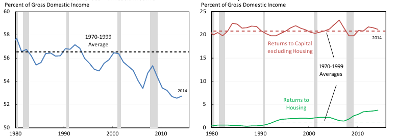
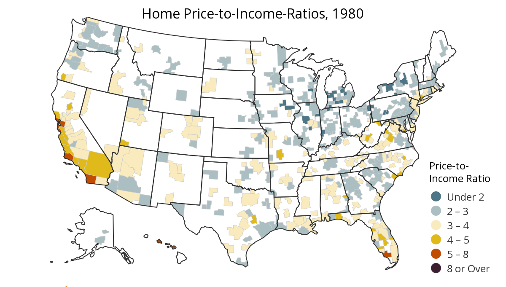
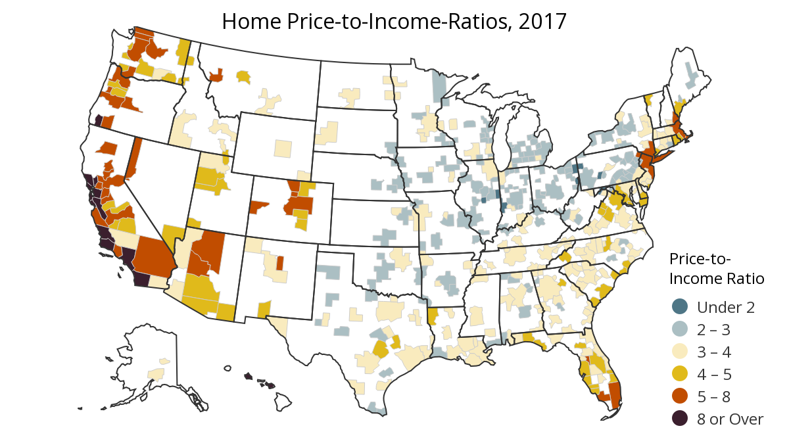
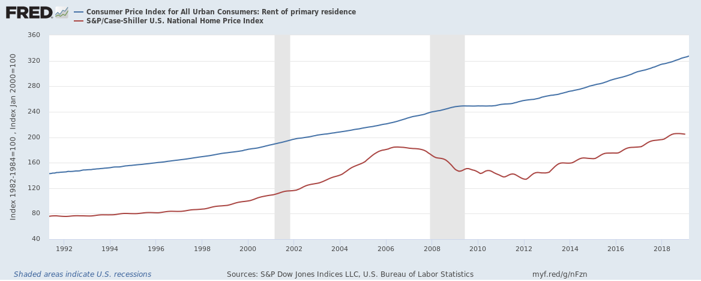
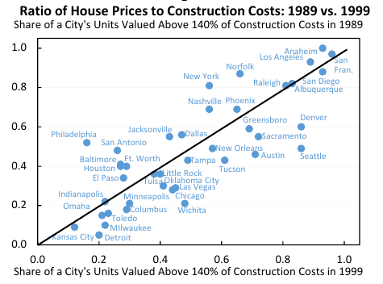
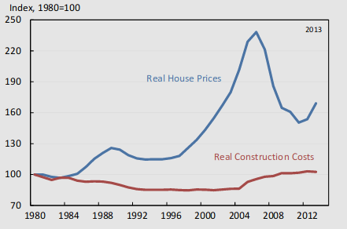

# Introduction

# What do Landlords Do? The Political Economy of Real Estate 

## Research Question

* What role does landed property play in growth and distribution under urban capitalism?

## Rent and Housing Costs

* from Rognlie (2015), calculated from Piketty & Zucman (2014). A note: income share going to housing also includes imputed rents to owner-occupied housing. It may be the case that including this on the labor side equalizes the outcome.

## Rent and Housing Costs

{ width=60%}
{ width=60%}

## Rent and Housing Costs

## The Regulation View (1) 

* Glaeser (2005a, 2005b) - Housing prices and regulation in Manhattan

* Glaeser & Gyourko (2002) - Housing prices and regulation by MSA

* Hsieh and Moretti (2015, 2019) - Housing constraints and spatial misallocation: 30% (!!!) cumulative decline in GDP due to regulatory supply constraints

* Ganong & Shoag (2017) - Restrictions on the housing supply prevent migration from low-TFP areas to high-TFP areas, driving regional divergence

* Giannone (2017) - Skill-biased technical change drives differential regional growth, leading to "superstar" cities sorting by skill

## The Regulation View (2)

{ width=75%}

## The Regulation View (3) - Spatial Equilibrium

## The Regulation View (4) - Spatial Equilibrium

* Firms and consumers are indifferent across locations

* *Land and construction markets are perfectly competitive*

* $\rightarrow$ Landlords earn marginal product, except in cases of distortion (i.e. restrictive zoning)

* Are land markets competitive? Are construction markets? *Really*? 

## Detangling Land, Housing, and Rent

* Land prices included in housing costs for macroeconomic statistics $\rightarrow$ how to decompose? 

* Land prices drive 87% of housing prices in the United States (Knoll et. al 2014) $\rightarrow$ how does this square with Glaeser et. al? (i.e., prices in excess of construction costs being driven by land values)

* Consider an increase in land value; total surplus value has not increased, but owner of land can command higher rents, and therefore a higher percentage of the social surplus $\rightarrow$ Ricardian outcome

	* The distinction between *wealth* aggregates and *productive capital* aggregates are not evident in national accounts! (Stiglitz 2015)

## Why is Land Not Capital? Why Does It Matter?

* Land (as applied to real estate) is non-produced, non-reproducible, and non-depreciable $\rightarrow$ land values *appreciate*, rather than depreciate

* Returns to land are *un-productive;* rental payments to landlord are drawn out of the social surplus but do not contribute to it (...mostly).

* The social surplus is divided in *three* ways: Land, labor, and capital

## Class Monopoly Rents

* Property rights over land and the long turnover time of structures give landlords large degrees of pricing power over renters. This results in a) relatively greater degrees of surplus extraction from renters on the lower end, and b) powers to speculate over potentially high-value unbuilt land. 

* Proposition a) has been empirically validated, contradicting the claims of the spatial equilibrium model.

## The Henry George Hypothesis

* Once un-owned land is occupied, economic rent becomes determined by *locational* advantage (i.e., the "unearned increment")

* Locational advantage in the urban context derives from access to: global networks, infrastructure, human capital

* As productivity increases, the ability of landlords to capture greater share of the surplus increases

	* Some questions: This does not quite seem to be the case after GFC-- small landlords were wiped out just as badly as large landlords

## The Role of the State

* To be determined

## A New Perspective on Land and Growth?

# Growth and Distribution in Regional Perspective

## Research Question

* What role does real estate play in determining national and regional income distributions? How does land policy affect this?  

# Scale and Power: the HQ game

## Research Question

* Are superstar firms extracting rents from urban states? Does this contribute to regional divergence? 

## Motivation

* How do we account for regional divergence?

* @giannone2017 and Diamond (2015) attribute divergence to skill-sorting between high-productivity and low-productivity cities $\rightarrow$ but what drives productivity differential? 

* How effective is the geobribery effort by states?

## Introduction and Literature

* 'Glocalization' [@brenner; @swyngedouw2004a] - changes in the scale of urban governance and finance

* municipal policy space increasingly constrained by availability of bond financing $\rightarrow$ bond rating agencies [@smith2010a]

## Descriptive Statistics

* a novel source of data: Good Jobs First subsidy tracker tracks federal, state, and local subsidies to individual corporations.

* a database of superstar firms (following @autor2017), geocoded with facility constructions

## Methodology

