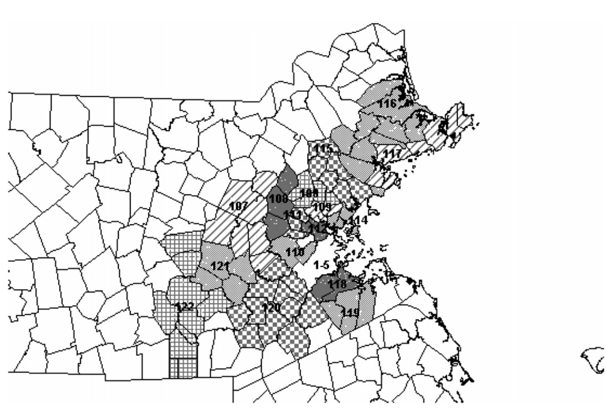

\newpage

# Introduction: Centering Space in Political economy

This prospectus outlines a proposal for three essays on the themes of urban
growth, distribution, and land use policy in the United States. The overall
motivation of this dissertation, in the broadest terms, is to understand how
rents in markets for land and housing affect economic outcomes for those
living and working in urban regions^[As @lefebvre2003 would say, "the urban"
is not limited merely to cities but rather to an entire global urban mode of
production. I tend to agree.]. Over the course of investigating this
question, this dissertation will touch upon questions of income and wealth
inequality, agglomeration and scale economies, growth theory, and housing
policy.

The discipline of economics has been going through something of its own
"spatial turn", lagging somewhat embarrassingly behind most of the other
social sciences. It has become increasingly obvious that heterogeneity of
outcomes across space, as well as time, is a persistent feature of economic
phenomena. In the past few years, much has been made about "superstar
cities," "superstar firms," and other highly-unequal features of the American
(and indeed, global) economic geography that seem to have their own centers
of gravity. At the same time, housing crises are being proclaimed in the most
prosperous of American cities, while the rest seem to be mired in stagnation
and urban decay. The *spatiality* of American economic life is finally
getting its own problematic, as growth and decline are recognized as
fundamentally place-linked. This dissertation serves as a contribution to the
spatialization of economics.

One of @soja1980's most lasting contributions was the idea of the
socio-spatial dialectic, in which social relations shape spatial relations,
which are in turn shaped by them. This shows up as an unevenness of social
relations across space and scale, as people and production shift from rural
to urban to suburban and possibly back again, with concomitant shifts in
social practice, political culture, and economic inequality. The tradition of
radical geography, starting with @lefebvre2003, has always fundamentally been
about the right to the city-- for whom does the city work, and to whom does
the city (and the benefits of living therein) belong? In this dissertation,
my aim is to examine a very narrow section of the discourse on the right to
the city. The question that I am concerned with, broadly, is "how do patterns
of land ownership determine the right to the city?" The essays outlined in
this prospectus are concerned with a proper subset of spatial relations, the
perhaps the most obvious ones: land ownership and land rents.

Land and land-rents, of course, have not always been relegated to the
periphery of the economics discipline. The problem of landownership and rents
were a primary concern of even the earliest classical economists. In *The
Wealth of Nations*, Adam Smith writes:

>Ground-rents, so far as they exceed the ordinary rent of land, are altogether
>owing to the good government of the sovereign, which, by protecting the
>industry of either the whole people, or of the inhabitants of some particular
>place, enables them to pay so much more than its real value for the ground
>which they build their houses upon... Nothing can be more reasonable than that
>a fund, which owes its existence to the good government of the state should be
>taxed peculiarly, or should contribute something more than the greater part of
>other funds, towards the support of that government.

The peculiarity of land ownership was, then, well-known to the classical
thinkers, Smith, Ricardo, Marx, and Keynes. The existence of a monopoly on
*space*, which is a fundamental condition of existence (for both the
production process as well as... well, anything) posed huge barriers to the
well-organized accumulation of capital^[Ricardo, for example, famously argued
for the abolition of the Corn Laws in England, leading to the eventual
liquidation of the English gentry as a class.]. The tripartite division of
the national product into wages, profits, and rents, was a relatively
uncontroversial tenet of political economy until John Bates Clark, armed with
marginal productivity and lacking a theory of land or land-rent, became the
groundwork for the neoclassical school of economics. This particular bit of
history of economic thought will be elaborated on further in Essay 1, but I
mention it here to motivate the contribution of this dissertation.

After the disappearance of land from the production function, space
reappeared in the neoclassical general equilibrium model as simply distance
and transportation costs. This work was begun by Von Thunen and continued
through Hotelling, leading to the development of what is now known as either
the the Standard Urban Model, the Alonso-Muth-Mills Model, the Monocentric
City Model, or the Spatial Equilibrium Model, which quickly became the
workhorse model for urban economic theory. The implications of the use of
this model will be explored in greater detail in the respective literature
section in Essay 1, but this class of models have a few features that are
here relevant for discussion. They exhibit typically CRS production functions
for a composite consumption good as well as for housing, varying degrees of
competitiveness in production and housing (but almost never labor) markets,
and the static solution is a spatial equilibrium in which consumer utility is
maximized such that no individual can be made better off by moving to a new
location^[this result leads to much of the debate in the literature (e.g.
@byrne) over whether gentrification is really welfare reducing]. Space and
land, in this view appear in a truncated form-- as *distance* and
*transportation costs.* "Rents" in the Standard Model are the *economic*
rents that occur from monopoly supply of a particular commodity, whereas what
we may call "house-rents" simply reflect local supply and demand for housing
services. *Agricultural* rents (referred to here by name) exist in the
Ricardian sense, and define the boundary of the city. Though some recent work
has focused on the heterogeneity of consumers with respect to asset
ownership, there are no neighborhoods to speak of here (and hence no
neighborhood stability to speak of). There are obviously no classes of
capitalists, workers, or landlords, and landownership is reduced from control
over a particular right of access to a general class of assets, each of which
in equilibrium earn a return equal to its marginal contribution to output.
Space and land reduce largely to Cartesian distance and transportation
costs-- the "annihilation of space by time" [@marx2005] in an analytic sense.
As a result, most research effort (including the interpretation of empirical
evidence) is focused on the idea of various types of "spatial mismatch," in
which various urban problems are the result of barriers (in many cases
regulatory but by no means always) to the smooth process of equilibriation of
land/labor/capital markets across space. Most of the well-known recent
literature on urban and spatial processes (e.g., @chetty2014, @moretti2013)
either implicitly or explicitly rely on the ideas of spatial mismatch and
spatial misallocation.

One of the radical geography critiques of this view is that it is entirely
*aspatial*. Space is conceived of as mere distance from the Central Business
District, which is itself a dimensionless point in space around which
production and consumption gravitate. Specifically, ownership of land conveys
a monopoly right of exclusion whose boundaries are politically
determined^[for example-- does one own the air over one's house? Does
ownership of a property guarantee an unimpeded view of the Rocky Mountains? A
share in the output of oil found under one's land?]. Land ownership is also
peculiar in the sense that land values are very strongly determined by
external factors; that is, land value, outside of agricultural productivity,
is almost wholly dependent on the social activity occurring on or around it.
This was a point understood by the classicals but greatly underscored by
Henry George-- the idea of the "marginal contribution" of land makes little
sense outside of the context of spatial relations.

Aside from aspatiality, this view of the urban economy is *ahistorical*. The
CBD is assumed to exist *ex-ante*, and

**Why is it ahistorical? Also talk about Krugman and NEG**

The rapid shift in the spatial awareness, so to speak, has become such that
scholars like @proost2019, very firmly in the neoclassical camp, begin even
themselves to sound like the radical geographers:

> Space is the substratum of human affairs, but  it  is  also  a  consumption
> and  production  good  in  the  form  of  land.  The  worldwide  supply of
> land is perfectly inelastic but vastly exceeds  the  demand  for  it.
> Therefore,  putting  aside  the  agricultural  land  rent,  the  price  of
> land  should  be  zero.  Yet,  housing  costs may be very high and vary
> enormously with  the  size  and  composition  of  cities  for  reasons  that
> do  not  depend  on  the  quality  of  the  housing  structure.

It is precisely this relationship, between the geographic unevenness of the
scale of human activity (i.e., the agglomeration of cities), the price of
land necessary for any human activity including the production of commodities
and the re-production of the labor force, that this dissertation will
investigate. In the body of this prospectus, I will outline my plan for
research on the role of land and rents in urban economics. In the first essay
I will develop a theoretical framework based on classical formulation of the
land and housing questions to investigate the relationship between urban
growth, land rents, and wages. I will begin by developing the concept of
urban space as theorized by the radical geography tradition and relating it
to the classical political economy thought surrounding land and rents. This
is a venerable strand of thought, going all the way back to Adam Smith,
Ricardo, Marx, George, and continuing through to Keynes. I intend to
demonstrate the ways in which the urban (productive) capitalist sector
interacts with workers and landlords in order to produce a given spatial
structure, spatial hierarchy, and income distribution. This will consist of
both a review of the history of economic thought on land rents and a
theoretical argument regarding the role of urban growth on rents and wages.

In the next essay I will apply the theoretical framework developed in the
previous chapter to the case of urban growth in San Francisco, California.
The city has several features that make it an interesting case study. First,
it has rapidly transitioned to the type of urban political economy that I
propose drive many of the effects discussed in the previous section-- namely,
one with a primary sector characterized with very large agglomeration
economies. Second, the city's (and the state of California's in general)
political economy features relatively powerful political classes of
landowners, but also those of workers and up-and-coming capitalists (except
for real estate, which is relatively weak compared to the East Coast). Third,
the city exhibits physical limits to sprawl (in the form of an ocean) and
also various levels of political constraints to expansion by the
aforementioned landowning class. Thus, it is a useful case study to explore
the way distributional conflict that occurs across urban space. The essay
will take a historical approach using descriptive and administrative data to
outline in broad strokes the evolution of land prices, wages, and rents. The
particular focus will be on the recent, post-Crisis history of the city, I
will spend some time outlining the historical development of the urban land
market in the context of large waves of public and private investment during
and following WWII. This essay will rely on descriptive data on wages,
profits, rents, housing construction, and evictions provided by the Census,
HUD, and the City of San Francisco. Other data on land rents and property
values are available from "big data" sources such as the Zillow ZTRAX
database and AirBnB short-term rental listings. Additionally, this essay will
use archival data on zoning and data regulations to examine the role of real
estate developers on the political economy of the city.

The final essay is an empirical investigation into the effects of rent
control. Though the consensus of the economics discipline is tilted heavily
against rent control as an appropriate mechanism to promote housing
affordability, this opposition is rooted largely in the theoretical argument
against price controls in general. To the extent that empirical work on rent
control has been done, the evidence for or against the policy is decidedly
mixed. This essay, then, represents a contribution to the scant-but-growing
empirical literature on rent control in the United States. Using data from
the American Housing Survey, this essay estimates the impact of rent control
policies in approximately 100 New Jersey cities on housing supply, land
values, rents, and neighborhood stability. The essay will employ a
quasi-experimental research design that exploits the fact that rent controls
are not implemented in a geographically systematic way; they are implemented
on a per-municipality basis, where the borders of a city are highly likely to
intersect a single rental market, providing a treatment and a control group.
This essay is intended to provide more empirical evidence on the impacts of
rent control on housing affordability in the United States.

Taken together, these three essays represent a contribution to the
understanding of the function of landownership and land rents in in
influencing the distribution of incomes in advanced capitalist economies
generally, with implications for the study of income and wealth inequality,
spatial patterns of growth and decline, and housing and urban policy.

\newpage

# What do Landlords Do? The Political Economy of Urban Growth and Distribution

## Abstract

This chapter is about urban growth, broadly speaking. Who wins when a city
grows? Who benefits from spatially-specific economies of scale and
agglomeration? In particular, how is the distribution of the gains to
economic growth affected by the distribution of and control over land (and
housing)? How are these distributional decisions made and implemented? In
this essay, I present a theoretical account of the way that cities grow, and
the way that this growth is divided between wages, profits, and rents. The
particularly urban process of agglomeration features heavily into this
account. I begin with the observation that neoclassical treatments of urban
growth have, since John Bates Clark, excluded land as a particular factor of
production. Without accounting for the role of landlords, any account of the
role of rents in urban growth (which, for obvious reasons, is likely to be
quite large) will likely to be insufficient. I follow this with a
presentation of the classical political economy thought on land rents and
growth, followed by a formal presentation of a broadly Marxian-Georgist
account of growth and distribution in an urban economy.

## Research Questions

1. To what extent are gains from public goods and productivity increases
captured by landlords?

2. How do the peculiarities of urban growth (agglomeration, long-lived
structures) affect the distributions of wages, profits, and rents?

3. What is the relationship between wages, profits, and rents in an urban
economy? What are the structural features of this relationship, and what
drives their apparent variation across cities?

\newpage

## Introduction

>What you have to understand is that in the late 1980s mainstream economists
>were almost literally oblivious to the fact that economies aren’t dimensionless
>points in space –and to what the spatial dimension of the economy had to say
>about the nature of economic forces. You may find this implausible –how could
>economists fail to take into account facts of life that are part of everyone’s
>daily experience? –but I can assure you that it was true. I recall a
>conversation at one conference on the “new growth theory” in which a fairly
>eminent economist challenged some of us, in belligerent tones, for any evidence
>that increasing returns and positive external economies actually play any
>important economic role. I think I replied “Cities” –to be greeted with a stare
>of incomprehension. [@krugman2011a]

This essay is motivated by a deceptively simple question: When cities grow,
do rents rise or do they fall? The simple Economics 101 answer is that when
more space is brought into the urban system (by, e.g. expanding the supply of
housing through either new construction or upzoning existing neighborhoods
for greater density), then rents should *ceteris paribus* fall. Indeed, with
varying levels of sophistication, this is the essence of the supply-side
spatial mismatch argument that arises from the SEM; excessively high growth
in rents results from barriers (regulatory, natural, or otherwise) to the
smooth adjustment of housing supply to housing demand, resulting in a
sub-optimal city size.

Of course, *ceteris* is never *paribus*, and the most confounding feature
comes from the nature of cities themselves: they are an increasing-returns
phenomenon, and the expansion of a city itself may be a function of the
desirability and productivity of that city. In other words, when a city
grows, the expansion of the housing supply may not result in a decrease in
rents; increasing urban density might, for example, *itself* cause greater
increases in demand due to higher productivity. Recent literature examining
the relationship between between labor and housing markets is surprisingly
mixed; @freemark2019 finds that in a subset of Chicago neighborhoods,
increased zoning density increased land values and rents but did not increase
the supply of housing. @li2019 found that for new market-rate high-rises in
New York City, a 10% increase in the housing stock reduced rents within 500
feet by 1%, an intriguing result if not only for the surprisingly tiny effect
size. @agarwal2019 show that, for 29 states that increased their minimum
wages during the study period, the entirety of the increase in wages was
counteracted by rent increases after five years. This last finding, and its
somewhat surprising generality, is at the heart of the central questions of
this essay; while I do not dispute the housing supply argument of the SEM, I
think evidence shows that housing supply constraints alone are not sufficient
to explain rising rents and declines in housing affordability. Even Ed
Glaeser, perhaps the most well-known neoclassical urban economists notes that
"highly elastic places had price booms is one of the strange facts of the
recent price explosion" [@glaeser2008].

This essay is an attempt to engage some of the insights of classical economic
thought on land and land-rents in answering modern economic questions of
growth and distribution. Although the study of landlords and rents was one of
the central focuses of political economy, the study of housing rents and
urban real estate is conspicuously absent. I intend to incorporate some of
the contributions of radical geography, particularly notions of *spatiality*
and *spatial hierarchy.* In this context, I will largely be addressing the
question of *land*, which is only a proper subset of the spatial relations
considered to comprise urban geographies. It is also important to note here
although much of the discussion is centered on housing costs in the form of
residential rents, the focus of this chapter is on land rents and land
ownership more generally, rather than on the particular problem of high
housing costs. This last feature is an important element of my critique of
some of the modern theoretical literature on urban growth, which I expand
upon further in the relevant section. The essay will be structured as
follows: First, I discuss the role of land rents and urban structure in
classical accounts of growth and distribution, paying particular attention to
Karl Marx and Henry George; Marx of course provides the framework for
thinking about class relations and distributional conflict, and George was
really the first of the political economists to address the problem of
landlords and rents in the context of specifically *urban* production and
distribution. The essential focus here will be to adapt the classical thought
on rents and landlords to questions surrounding the dynamics of modern urban
land and housing prices (essentially: how do urban agglomerative effects
interact with rents?). Following that, I will develop these into a formal
theoretical presentation.

## Literature Review

Much of the recent urban economics literature on growth has focused on two
things: human capital theories of growth (of which skill-biased technical
change and spatial skill sorting play an outsized explanatory role) and the
effects of housing supply constraints. All of these rely broadly on the SEM
and associated "spatial mismatch" explanations-- in other words, some factor
is preventing labor or investment from being directed to its most efficient
location in space.

@moretti2013 begins with observation on the evolution of inter-city
inequality over the past 5 decades. He identifies significant and persistent
heterogeneity in American economic geography, but points out that only
recently has this heterogeneity been driven by high rates of human capital(as
measured by college degree attainment) in so-called "skilled cities." His
theory of urban agglomeration is centered around knowledge spillovers. A kind
of schematic metaphor for this process is a group of high-skill workers
gathering for beers after work-- despite being from different industries,
their proximity and discussion is the substratum for the creation of new
ideas and entrepreneurial energy. a consequence to this is that if the gains
to knowledge spillovers are high, then a city with a "small-firm" ecosystem
will tend to do better, pay higher wages, and grow more, than a city with a
"large-firm" ecosystem. However, growth in productivity will, absent growth
in the housing stock, will tend to drive up rents, leading to declines in
inter-city mobility and a skill-sorting equilibrium where human capital is
drained out of declining cities. Indeed, @ganong2017 have found that both
income divergence and migration between cities has declined since the 90s.
@gianone2017 use a SEM and Census data to argue that skill-biased technical
change explains in part the decline in regional income convergence-- in
essence, low-skilled workers become "trapped" in low-skilled cities as rents
rise high-skilled cities. @rossi-hansberg2019 develop an extension of the
human capital spatial equilibrium model to argue that cities with large
numbers of "cognitive non-routine" (CNR) are more productive than those with
fewer, and that divergence between high-rent-high-wage cities and
low-wage-low-rent cities is optimal, given a transfer payment from
high-productivity workers to low-productivity ones. In other words, given
preferences for smaller city sizes in knowledge hubs, these wealthy cities
should pay less-skilled people to stay in low-rent cities. The unspoken
assumption that remains relatively unquestioned in this literature is the
distribution of "skills." Are high-CNR cities *drawing off* high-skilled (or
potentially high-skilled) workers, or are they *creating* high skilled
workers? This question is addressed somewhat more explicitly in the newer
labor literature surrounding mobility and human capital, e.g. @chetty2014.

This "trapping" effect requires a high-skilled pull (in the form of high
wages) and a low-skilled push (in the form of high rents). The push factor is
relatively extensively theorized in the urban literature. @glaeser2002, in
their seminal paper, use the divergence between housing prices and
construction costs to argue that prices are much higher than one would
expect, given perfectly competitive assumptions about the real estate
development industry. Under these assumptions, the argument is perfectly
valid; any distortions such that prices do not equal marginal costs should be
the result of market failure or government intervention. However, it is
unclear to me that the construction industry or land markets in general can
be called perfectly competitive, especially in densely built urban areas.

This essay is also motivated by the uneven development and rent gap literature,
particularly those of @harvey2018a, @smith2010, @hackworth2000, and the
Marxian-Sraffian modeling and simulation approach developed by @bergmann2009,
@sheppard1984, and @plummer1998.

The few empirical papers that have been done on the topic of land rents have
found mixed results. @freemark2019 finds no evidence that supply-side policy
(in particular, zoning for greater density in several Chicago neighborhoods)
do not necessarily result in the reduction of rents or expansion of the
housing stock (let alone the expansion of the *affordable* housing stock).
Finally, as mentioned in the introduction to this prospectus, the effects
identified by @agarwal2019 are precisely the phenomenon this essay wishes to
investigate; they find that five years after an increase in the minimum wage
in 25 states, rent increases had absorbed almost all of the increased income.
The scope of this effect seems to weaken the supply-side argument regarding
housing costs; if increases in income are, in general, captured by landlords
across different geographies with presumably different housing supply
elasticities, it points to some other factor that tends to drive up rents in
the face of wage increases. Indeed, @li2019 find that the neighborhood-level
effects of new market-rate construction had a rather surprisingly small
effect; a 10% increase in the housing stock in the form of high-rise
apartments resulted in a 1% decrease in rents in a 500-foot area surrounding
the construction.

Finally, @knoll2014 also find that 87% of housing price shifts in the United
States during the last century can be attributed to changes in the price of
*land*. It is, again, unclear whether we can attribute prices in excess of
marginal costs to construction or something else. Here the SEM approach is
particularly poorly-suited to deal with the question of land, treating
returns to land ownership the same as capital income. Thus, in this essay I
propose a re-spatialization of urban economic theory, using the classical
approach with land as a separate factor of production as a base.

### Classical Views of Rent

Land rents emerged as a chief concern for the early study of political
economy, beginning largely in the realm of agricultural production.
@ricardo1821 began with the assumption that the quantity of land available
for cultivation was fixed, and therefore land itself had no price of
production. He observed that land of differential fertility produced
differential levels of output, and the most fertile land was generally the
most limited in supply.

Consider a world with three plots of land, $n_1, n_2$, and $n_3$. Each $i$
plot yields, given identical inputs of labor and capital, an output of corn,
$x_1 < x_2 < x_3$. Each plot is owned by a landowner, who is paid a rent by a
(capitalist) farmer, who pays a fixed wage $w$, and faces a market output
price of $p$. The profit earned by the capitalist farmer on each $i$ plot of
land is then:

$$ \pi_i = x_i p - w, $$

where $\pi_3 > \pi_2 > \pi_1$. In the case of only the two most fertile plots
of land, $n_{2,3}$, after the most fertile plot is cultivated, earning
$\pi_3$, the next plot is cultivated, earning $\pi_2$. Once the second plot
is under cultivation, the owner of plot $n_3$ can extract a rent from the
farmer up to the difference $r_3 = \pi_3 - \pi_2;$ the farmer can either pay
the rent or earn $\pi_2$ anyway by directly cultivating $n_2.$ Likewise, as
the least fertile land comes under cultivation, becoming the marginal or
"rent-free" land, the amount of rent $r_3$ becomes $\pi_3-\pi_2.$ As the
difference between the most-fertile and least-fertile cultivable land widens,
the amount of rent extracted by owners of land with greater-than-marginal
fertility increases. This is the basis of Ricardo's *differential rent.* He
used this as the basis of his argument against the English Corn Laws; as the
population increased, the demand for food and hence agricultural land
increased, bringing worse and worse marginal land under cultivation. This
would cause differential rents to increase and profits to fall, choking off
the accumulation of capital. The solution, in abolishing the Corn Laws, was
to radically expand the scope of English agriculture to the whole of the
Empire, bringing new fertile lands under cultivation and ruining the English
landowning class.

Marx's discussion of ground-rent is spread throughout *Capital Vols. II,
III,* and *Theories of Surplus Value.* Following Ricardo, Marx also deals
primarily with the case of rents in agriculture and mining, paid to a class
of landlords by a class of capitalists. We can make use of @resnick1989's
framework here and think of the institution of land ownership as a *subsumed
class process*, where the surplus value generated by the productive sector is
then distributed to the landlord class as a condition of existence of the
*fundamental class* process, which is the direct extraction of surplus value
through the process of commodity production. Marx begins with the premise
that "landed property is based on the monopoly by certain persons over
definite portions of the globe, as exclusive spheres of their private will to
the exclusion of all others." Under capitalist relations, the relationship
between the landlord and the industrial capitalist "...totally separates land
as an instrument of production from landed property and landowner--
*for whom the land merely represents a certain money assessment which he
*collects by virtue of his monopoly from the industrial capitalist*,
the capitalist farmer..." (emphasis added). In other words, land becomes an
expression of monetary value, which represents a claim on the production
generated by the capitalist by virtue of the institution of private property.
Ownership of the land represents a *claim* on the *future productivity* of
that land. @basu2018 remarks: "Under capitalist relations of production...
limited quantity and private ownership of the non-produced resource come
together to create impediments to the free movement of capital into [the
sector taking the non-produced resource as an input]. That creates the basis
for the emergence of rent^[this formulation may have some interesting
extensions into the production process for other commodities whose prices of
production are essentially zero, for example software.].

In addition to Ricardian differential rent, Marx added a second form of
differential rent that emerged from different quantities of capital invested
on different plots of land, and the concept of *absolute rent:*

>Assuming then that demand requires the taking up of new land which is,
>say,less fertile than that previously cultivated, will the owner of this land
>lease it for nothing just because the market price of its product has risen
>high enough for capital investment to pay the farmer the price of production
>and thus yield him the customary profit? In no way. The capital investment
>must yield him a rent.He leases only when a lease-price can be paid. @marx1991

Absolute rent represents the distribution of surplus value to the subsumed
class process. Since landowners have monopoly control over the disposal of
their property, landlords can capture enough surplus from the capitalist as
rent so that the capitalist is forced to earn the average economy-wide rate
of profit. Following Basu, and using a standard Marxian framework^[$c$ is
constant capital, $v$ is variable capital, $s$ is surplus value, $r$ is the
capitalist rate of profit, and $\alpha$ is the economy-wide average rate of
profit.]:

Ricardian rent, or Differential Rent I (DRI), is the difference in profit
*rates* between any $i$ plot of land and the least productive plot:

$$ DRI_i = (c_i + c_i)(r_i - r_1) $$

Differential Rent II (DRII) arises from the differences in the amount of
capital invested on different plots of land, and so is compared to the
difference between the rate of profit on the worst land and the
*economy-wide* rate of profit:

$$ DRII_i = [(c_i + v_i) - (c_1 + v_1)](r_1-\alpha) $$

Finally, absolute rent is the amount of rent that the landlord of the worst
plot of land is able to obtain, which is the difference between the rate of
profit on the worst land and the economy-wide average rate of profit:

$$ AR = (c_1 + v_1)(r_1 - \alpha) $$

Thus, the total ground-rent becomes

$$ GR_i=DRI_i+DRII_i+AR_i= (c_i+v_i)r_i-(c_i+v_i)\alpha = (c_i+v_i)(r_i-\alpha), $$

where the final expression on the right-hand-side is equal to the total
*surplus profit* (i.e., higher-than-average profits). Marx here argues that
the entirety of the surplus will be bargained away to landlords as rents,
forcing capitalist farmers to obey the law of value and in the long run earn
the economy-wide average rate of profit.

It is important to note three points: Marx and Ricardo both analyzed
agricultural production, with differential rents arising from different
levels of fertility (and capital investment, in Marx's case). They both
mention "locational advantage" as other forms of differential productivity,
but what this means and how it works was not elucidated. Second, this section
deals primarily with land as a direct input into production, i.e. as
*commercial* real estate. Neither Marx nor Ricardo dealt with *residential*
real estate, which does not enter directly into the production of
commodities, but indirectly as an input to the production of *labor-power.*
In this case, private landownership still functions as a subsumed class
process, a necessary condition for capitalist production, but the
relationship between *wages* and ground-rents are not discussed-- in this
formulation, rents simply appear as a transfer from the capitalist class to
the landowning class, and the existence of a private market in land
functioned fundamentally as a barrier to the accumulation of *capital*,
rather than as a source of declining living-standards for the worker^[This
was a point made by @lenin1907 in his criticism of the Narodniks: "The
Narodnik thinks that repudiation of private landownership is repudiation of
capitalism. That is wrong. The repudiation of private landownership expresses
the demands for the purest capitalist development. And we have to revive in
the minds of Marxists the 'forgotten words' of Marx, who criticised private
landownership from the point of view of the conditions of the capitalist
economy...Consequently, the abolition of private landownership is the maximum
that can be done in bourgeois society for the removal of all obstacles to the
free investment of capital in agriculture and to the free flow of capital
from one branch of production to another. The free, wide, and rapid
development of capitalism, complete freedom for the class struggle, the
disappearance of all superfluous intermediaries who make agriculture
something like the 'sweated' industries-- that is what the nationalisation of
the land implies under the capitalist system of production."]. Finally, the
mechanism for the extraction of absolute is not clearly defined-- can
landlords really bargain away *the entirety* of superprofits in agriculture?
What are the constraints on this process? How does it operate in the context
of *urban* real estate?

While Marx focused on the relationship between labor and capital in
relatively land-scarce Europe, Henry George directed his analysis on the
relationship between labor and *land* in the land-abundant United States. At
the time, land interests were perceived as holding back the rapid
industrialization of the United States. Mirroring the American
Transcendentalists of his day, he held that land should either be held in
common by all people, as an "endowment from God" [@george2015], or the entire
value of bare land should be taxed away and used for public investment. The
circumstance of land-abundance is an important factor, since the boundaries
of the city are no longer determined by the agricultural margin, but the
boundaries of commuting technology.

George was the first to write about land rents in an explicitly urban
context, in which both economies of scale and agglomeration play a role. The
first arises, remarks @whitaker2001, from an increase in scope of the
potential division of labor that comes with a general increase in population:

>increased population,of itself, and without any advance in the arts, implies
>an increase in the productive power of labor... with every additional pair of
>hands which increasing population brings, there is a more than proportionate
>addition to the productive power of labor. [@george2015]

Whereas this scale affect arises simply from an increase in population,
George also focuses on agglomeration effects that arise from the
concentration of people in a specific, i.e., urban, area:

>...for the increased powers of co-operation and exchange which come with
>increased population are equivalent to-- nay, I think we can say without
>metaphor, that they give an increased capacity to land, brings out a superior
>power in labor, which is localized on land—- which attaches not to labor
>generally, but only to labor exerted on particular land; and which thus
>inheres in the land as much as any qualities of soil, climate, mineral
>deposit, or natural situation, and passes, as they do, with the possession of
>the land...

In other words, the specialization that is afforded to production on a
specific piece of dense urban land itself increases the productivity of that
land in much the same way as a natural difference in fertility in the
Ricardian story. And, as in the Ricardian story, the difference between the
current productivity of the land and the surplus on the no-rent margin can be
captured as differential rents. Thus, any action that increases the
concentration of population in a particular urban space also increases the
productivity of that space, but because of the nature of private land
ownership, any gains to that productivity are captured by landlords; an
additional worker that moves to an urban agglomeration has *external effects*
on the productivity of other workers for which he or she is not compensated
for by an increase in the wage, *and* that these gains are a pure
redistribution away from the productive sector of the economy^[More recent
Marxist accounts of this, e.g. @harvey1974, point out that this need not be
entirely redistributive; capitalist land markets do have an
efficiency-enhancing function by directing production to its most
*locationally* profitable use.].

This essay seeks to interrogate the *extent* of the landlord's ability to
bargain away the surplus. Workers' standards of living do occasionally rise,
and firms are able to make profits over and above the amount paid to
commercial rent. Historically, returns to real estate investment have risen
and fallen with respect to corporate productivity, in a geographically uneven
fashion. If, as in the question of wages, the payment of rent is determined
by relative bargaining power, then what are the parameters of the bargaining
problem? What strengthens land against labor and land against capital? At
what point do their incentives align? These are the questions that this essay
intends to interrogate.

The Henry George Theorem^[in its general form (Arnott 2004): "in any
constrained Pareto optimal and nontrivial allocation of population in a
spatial economy, the aggregate shadow losses from increasing returns to scale
activities just equal the aggregate shadow profits from the decreasing
returns to scale activities."], first formalized by @arnott1979, shows up
occasionally in discussions of public finance. It shows that, under certain
conditions, aggregate spending based on public goods will increase aggregate
rent by at least the amount of spending, due to the increases in land values
in the surrounding urban area. In this essay I will discuss the HGT as
formulated by Stiglitz and Arnott, with an extension to the case of *private*
investment and wage growth. For this proposal, I will point out that the
theorem highlights the *externality* problem facing urban planners and urban
residents: each landlord's relatively absolute control over their own
personal fiefdom allows them to accrue external benefits from both public
*and private* actions undertaken outside their property. This has
particularly salient real-world applications-- how does a city develop, for
example, a public transportation network, when the resulting increase in
locational value shows up in asset appreciation for the landowners
surrounding the transit node? George was limited by his analysis of the
relationship between labor and capital. For him, the ratio of wages to
profits was assumed to be constant, and they both rose and fell in the same
proportion in the face of rising or falling rents. One of the questions this
dissertation attempts to address is that, if land rents are the result of
distributional conflict between land and labor, how does this affect (and
become affected by) the distributional conflict between labor and
capital^[Marx famously commented rather harshly on the Georgist Single Tax
Movement, writing in a letter to Friedrich Sorge 'All these no-rent
agricultural margin'socialists' since Colins have this much in common that
they leave wage labour and therefore capitalist production in existence and
try to bamboozle themselves or the world into believing that if ground rent
were transformed into a state tax all the evils of capitalist production
would disappear of themselves. The whole thing is therefore simply an
attempt, decked out with socialism, to save capitalist domination and indeed
to establish it afresh on an even wider basis than its present one."]?

In George's own words:

>To recapitulate: The effect of increasing population upon the distribution of
>wealth is to increase rent, and consequently to diminish the proportion of the
>produce which goes to capital and labor, in two ways: First, by lowering the
>margin of cultivation. Second, by bringing out in land special capabilities
>otherwise latent, and by attaching special capabilities to particular lands. I
>am disposed to think that the latter mode, to which little attention has been
>given by political economists, is really the more important.

On this point, the author of this dissertation proposal agrees.

## Methodology and Conclusion

In this essay, I intend to proceed as follows: I begin with a more
comprehensive review of contemporary literature in urban economics,
place-based labor economics, and (New) Economic Geography. This will serve as
a starting point for the discussion of the relevant issues of urbanization,
housing, and rents. I then focus on a detailed history of economic thought on
the topics of land rents and urbanization, reviewing Smith, Ricardo, Sraffa,
and Keynes, with a particular focus on Marx and George, and their associated
successors in the discipline of economic geography. Finally, I condense this
into a presentation of the relationship between wages, profits, rents, and
density. The intent of this essay is summed up by the following conjecture:

Cities are, by nature, an increasing-returns phenomenon. In light of that
fact, when cities become more dense, it is likely the case that the
productivity of a particular city increases, leading to greater relocations
of firms, and greater demand for land and housing within the city. The land
commodity has peculiar features in terms of its elasticity of supply and the
way that space interacts with the existence of any particular process. These
features of land markets may have very large implications in the distribution
of income. For example, if increased density increases the amount captured by
landlords, then the market urbanist prescription of simply upzoning and
constructing market-rate housing may result in an increase in the housing
supply but without any decrease in rents. Additionally, the long-lived nature
of the *housing* commodity, and the increasing costs of building more
density, mean that out-of-equilibrium dynamics of urban economies become
highly important. It doesn't seem likely, even if we grant the assumptions of
the SEM, that land and housing markets adjust as quickly as labor markets do,
especially in the case of urban *decline.* The Rust Belt is evidence of
cities that were once highly productive, with relatively high wages, and land
and housing that were once highly valuable but now no longer so. Finally,
land and housing markets are the site of *political* battles over
distribution, with the political-economic equilibrium in many cases differing
markedly from the standard static equilibrium outcome.

\newpage

# On Growth and Rents in San Francisco

## Research Questions

1.  To what extent was regional growth in productivity and public investment
    captured by landlords? How was productivity growth divided between wages and
    rents in San Francisco?

2. Are high rents caused by wages, or are high wages the result of high rents?
   If the latter, what is the determinant of higher rents? (Are rents wage-led
   or profit-led?)

3. How does the geography of firms affect the functional distribution of income?

## Abstract

This essay applies the framework developed in the previous essay into a
historical-descriptive account of the growth and development of the city of San
Francisco. Focusing on the period of growth immediately after the 2008
recession, this essay will use a variety of data sources to investigate the
spatial patterns of growth in the city during this period. In particular, this
essay will focus on the way that urban growth has been capitalized into wages,
profits, and rents. This will involve mapping those variables at a granular
level, as well as investigating the effects of the spatial location decisions of
firms on wages and rents in surrounding neighborhoods.

## Introduction

How do patterns of land ownership determine the Right to the City? For
@soja2000, this was perhaps one of the most fundamental questions for thinking
about the relationship between the social and the spatial. The historical phases
of business cycles, crises, labor and capital movements all imprint themselves
quite literally in the structures of the built environment. All of these
historical phenomena affected and were affected by the development of urban
cityspace (in both the sense of urban social relations in general and of
specific cases of particular cities), creating a sort of urban archaeology--
layers of bone and sinew upon which successive generations of structures
(physical, institutional, and cultural) were built.

In the previous essay, I hope to establish the link between the corporate
(productive) sector and land markets, operating through the mechanism of the
labor market. In this essay, I will focus closely on a specific historical
case study of urban investment, land valorization, and rent extraction.

The Bay Area in general has for many decades been the focal point of public and
private investment into the technology sector. This has been traditionally
centered around Menlo Park and the Silicon Valley. Biotechnology firms have
traditionally dominated the economy of the city, but a new wave of
technology investment has targeted San Francisco proper itself; in 2010, the
flow of venture capital to San Francisco overtook that of the Valley
[@mcneill2016], bringing forth “[s]trange new hybrids” of “Silicon Valley
innovation, VC investment and Wall Street financialization, and digital
transformations of circuits of production and consumption” [@wyly2014], and
since 2012, over 30% of the city's employment growth has been in the
high-technology sector.

This essay is not exactly about the rise to dominance of hi-tech capital in
the Bay Area. However, it would be impossible to talk about the evolution of
land ownership and rent extraction without also developing the history of
what @mcneill2016 calls "technology investment capital" and its role in
driving the economic geography of technology firms and its resulting effect
on wage and rent growth. In many cases, the commodity produced by these firms
is *literally* the "annihilation of space by time," and are in greater and
greater proportion funded by extremely wealthy individuals and venture
capital firms, rather than through public equity. These giant firms (both in
terms of valuation and market power) wield outsize influence on the political
process of the city, and so serve as an interesting laboratory to examine the
distributional conflict over wages, profits, and rents at the urban scale. Most
salient for this essay is that for various reasons, these firms also exhibit
very large agglomerative effects. @moretti2013, @florida2014b, @florida2019,
@glaeser2009a, and many others of the human capital school of urban growth
attribute this to the structural nature of spillover effects from cognitive
non-routine (CNR) tasks. I intend to discuss this and other views of
agglomeration effects in Essay 1, but suffice it to say that these firms do
exhibit massive gravitational pull, driving productivity and migration and
straining against the political and physical limits of the built environment.

Tech firms intervene heavily in the political economy of the built environment
of San Francisco. Aside from short-term rental platforms like AirBnB, these
firms spend tremendous amounts on influencing local politics through the
municipal ballot system and mayoral elections. In addition, these firms have
begun to intervene directly into markets for land [@li2019a], and housing
[@li2019b], as well as building parallel private municipal infrastructure to
alleviate the bite of rising residential rents.

For its part, aside from the story of agglomeration and increasing returns, the
particular features of land and housing markets in San Francisco will be
discussed. On the urban scale, the Ricardian assumption of a fixed supply of
land holds strongly, since the city is bounded on three sides by the Pacific
Ocean. 

It is here that the discussion of the technology sector becomes a central issue
to a discussion about land and land rents. As @stehlin2016 remarks in his essay
on gentrification in San Francisco:

>...urban space is in certain ways becoming the “shop floor” of a labor process
>central to San Francisco’s position in the spatial division of labor of the
>tech economy. My intention here is to open up a space to consider
>neighborhood use-values as “means of production” that enter the valori-
>zation process at multiple sites: as elements of ground rent, as reproduction
>of labor-power, as inputs to value production, and as sites of contestation.

As the city itself becomes a "shop floor" in the process of production of
exchange values, urban space, and crucially, land, become battlegrounds for the
conflict over surplus value between firms, workers, and landowners. It is the
aim of this essay to trace the contours, ebbs, and flows of that struggle
through the relationship between the geography of urban accumulation and
neighborhood-level changes in wages, land values, and rents.

The main questions that this essay will consider are as follows: How has
the functional distribution of income changed during the post-Crisis growth of
San Francisco? How did increases in productivity from both technological change
and public investment become capitalized into land prices and rents? To what
extent did they lead to increases in wages, and to what extent did they show up
in higher housing costs? How does the geography of the firm, and specifically, of
the large technology firm, affect the relative power of the working and
landowning class, respectively? Finally, what are the roles of real estate
institutions on the conflict over the surplus product, in the context of
conflict over zoning, migration, and the housing supply? *Put plainly, in the
simple language of the economics profession, this essay intends to examine the
particular ways that agglomerative productivity shocks have historically been
distributed through wages and rents.*

## Literature Review

As the most interdisciplinary of the essays in this dissertation, the
academic literature in its genealogy is accordingly broad. The most direct
starting point is the literature on socio-spatial dialectics, starting with
@soja1980. Soja's idea of *synekism,* the "stimulus of urban agglomeration
heavily influences the direction of the historical analysis in this paper;

>[synekism is] seen as a continuous and highly politicized process of urban
>growth and development, a dynamic process that provides a constantly evolving
>source of stimulating social synergy and is part of the very essence of urban
>life... [it] involves the creativity, innovation, territorial identity,
>political consciousness, and societal development, political consciousness, and
>societal development that arise from living together in dense urban regions.
>It is in this sense that I define synekism as the *stimulus of urban
>agglomeration* and connect it directly to what can be described as the *spatial
>specificity of urbanism*-- the real and imagined, material and symbolic,
>geographies or spatialities of urban life.

Following @mcneill2016, I consider synekism as the value-generating process that
occurs not merely in the productive sector, but in urban space as a whole; the
distribution of this value-generating process into different strata of society
is the outcome variable, in a sense, that this essay wishes to measure. This
essay also draws heavily from the Marxist urban geography literature.
@harvey1974's Class Monopoly Rent argument, where "the rate of return to a class
of providers of an urban resource (such as housing) is set by the outcome of
conflict with a class of consumers of that resource" underlies the point of
entry of both this and the previous essay, and Harvey's analysis of landlords
and residents in the city of Baltimore is similar to the analysis intended to be
presented here. The literature on urban public and private goods referred to in
essay 1 is also relevant here, along with @heim1996 and @heim2015.

This essay also relies extensively on the growth machine literature, beginning
from @molotch1976. Critically so, in that traditional growth machine politics
centers the role of the "landed elite" in a story of suburbanization and
inner-city decline.  

As @arnott1995 remarks, much of the oxygen in the urban economics space is taken
up by analyses of New York City, and there has been surprisingly little recent
work done on West Coast cities and San Francisco in particular. @bourne1993
reviews the factors leading into the second wave (1992-1999) wave of West Coast
gentrification. @opillard2015 discusses the role of tenant organizations and
urban politics in the resistance to the most recent, ongoing round of
gentrification. @mcneill2016, @stehlin2015, and @graham2002 specifically address the role of
technology capital in re-structuring the urban environment, and are similar in
theoretical basis to this essay. 

## Data and Methodology

This essay will take a primarily descriptive approach towards the recent
economic history of the city, relying on a wide variety of data sources to
examine patterns of wage growth, rent growth, property development, firm
location, and political conflict. This essay will also rely heavily on
quantitative spatial analysis, using GIS tools to measure the geospatial
clustering of firms and examine their effects on neighborhood-level wages and
rents.

### US Rental Housing Finance Survey

The RHFS is the only recent, nationally representative survey of property
owners. The survey was conducted in 2012 and 2015. It uses a stratified
random-selection procedure to conduct its sample. The first two strata
created were: 1) all large cities (with more than 100,000 housing units) and
2) a random selection of smaller cities and rural areas. Second, four other
strata were created: properties with 1) 2-4 units, 2) 5-24 units, 3) 25-49
units, and 3) over 50 units. Multiunit rental property addresses were
identified from the Census Master Address File and randomly selected from
each of the eight strata. This procedure produced a representative survey of
multifamily rental properties across the United States. The RHFS excluded
prefabricated homes, mobile homes, public housing, and single-unit rental
properties. This last element, which includes condominiums, may pose a bias
risk as mentioned above. The RHFS asked a battery of questions about housing
finance, property values, expenses, and revenue, including: mortgages,
landlord expenses (including property taxes, insurance payments, utilities,
property management fees, maintenance, security, and repairs), potential rent
revenues, and actual rent revenues. The restricted version of the dataset is
geocoded to provide locations for each building used in the sample, which
would allow for household-level analysis of patterns of rents and rental
finance. I am currently beginning the process to obtain permission from HUD
to use the restricted-use data.

### San Francisco Open Data

The City of San Francisco provides a wide variety of public-use data.
Property tax assessment data is available going back to July 1, 2008,
including property location, property value, and other physical property
characteristics. This data will be geocoded to get a granular view of
assessed values at the individual property level. Property tax data also
distinguishes the value of the structure and the assessed value of bare land.
Using assessed values brings up a difficulty, however; Proposition 13 in
California, passed in a 1979 ballot initiative, infamously limits growth in
taxable assessed value by 2% each year. When the property is sold, the
assessed value may be re-assessed at the market rate. In practice, this has
severe distortionary effects on municipal finances, as well as providing
strong disincentives to selling for incumbent homeowners. This phenomenon
will be an element of the discussion of this essay, but for the purposes of
geospatial data analysis, this will result in large variances in assessed
values based on duration of homeownership. This can be remedied by looking at
market values of housing in the ZTRAX database, discussed below.

The city also provides data on both building permits and building completions,
and business licenses, starts, and locations. Linking these will provide a
snapshot of the linkages between firm location decisions, land values, and
housing construction. Finally, the city keeps detailed records of any evictions
performed under the Ellis Act, which allows landlords no-fault evictions in the
case of "going out of the rental business--" either moving in as owner-occupant
or converting to condominiums. These can provide evidence of changes in rents
and shifts in the political balance of power. 

\newpage

# Rent Control Revisited: Is it Good, Actually?

## Research Questions

1. To what extent is the housing supply affected by rent regulation?

2. To what extent is the *rental* housing supply affected by rent regulation?

3. To what extent do rent controls accomplish the goals of maintaining housing affordability and neighborhood stability?

## Abstract

This essay is a contribution to the empirical literature on rent control in
the United States. Despite re-invigorated demands for rent control policies
globally, the consensus of the economics discipline has remained solidly
against the measure. Most of this opposition is on theoretical grounds,
rather than empirical evidence. How severe are the deleterious effects of
rent control on the housing supply, rents, and neighborhood composition? Does
it really achieve the desired goal of neighborhood stabilization, or does it
merely increase the rate of gentrification and growth in housing costs? This
essay addresses the difficulty of empirical work on housing in general, and
estimates the impacts of municipal rent control policies on rents, tenure
lengths, neighborhood amenity access, the rate of new housing construction,
and the supply of rental housing.

## Introduction

Rent control is considered as solved a problem as any in economics, with the
consensus of the vast majority of economists being that it is a textbook case
of unintended consequences. Rent control is, of course, a price control, and
the consensus view is that it results in social waste, lower housing quality,
housing shortages, and paradoxically higher rents. Despite this, in the face
of rapid growth in housing costs in many of the metro areas of the USA, many
state and local governments are calling for (and enacting) rent control
regulation.

Similar to academic consensus on the minimum wage prior to the 1990s
empirical labor literature, the negative view of economists on rent control
is widespread despite empirical evidence being mixed, at best-- much of the
existing literature struggles with external validity and limited-scope
problems. This chapter serves as an empirical intervention into the rent
control debate. Taking a cue from the minimum wage literature, this essay
intends to estimate the comparative impacts of rent control policies on
several variables of interest-- namely, growth in the housing stock, growth
in the supply of rental housing, home prices, rents, and neighborhood
stability.

While much of the existing literature focuses on exploiting single-city
changes in laws to identify the impacts of rent regulation, relatively few
have looked at modern rent controls at wider scales. This in part can be
attributed to the relative rarity of rent regulations in the United States.
As of 2019, the approximately 200 cities that have some sort of rent
regulation are concentrated in New York, New Jersey, and California. This
essay selects a subset of these cities, namely 99 cities with more than
10,000 people in New Jersey, for empirical study ^[see Appendix A for a list
of rent-controlled municipalities provided by the New Jersey Department of
Community Affairs] I chose this subset of cities because, as part of a single
metropolitan region, cities in the New Jersey area can be plausibly seen to
be part of related rental markets. New Jersey municipalities are also
relatively free from interference from state rent control laws, as opposed to
powerful political opposition at the state level to rent regulation in
California.

## Literature Review

@pastor2018 provides a general overview of the recent empirical literature on
rent control. They find that the literature is relatively straightforward on
the effect of rent control on rents-- that is, rent control reduces rents for
rent-regulated housing units. They also find the evidence to be much more
lukewarm than the theory on the supposed destructiveness of rent regulation.

@gilderbloom2007 estimates the impacts of second-generation rent controls on
a cross-section of New Jersey cities. Their paper is the closest to this
essay's subject, using the same area of analysis. The authors argue that most
New Jersey cities have a "moderate" form of rent control allowing for a
guaranteed rent increase every year, and with some cities including a vacancy
decontrol provision. They use data from a survey by the New Jersey Tenants
Organization at the city level of observation, and tested using OLS. They
found that "moderate rent control had no impact on median monthly contract
rent." They also found evidence that rent controls *increased* the supply of
rental housing by incentivizing landlords to subdivide their rental units.
Overall, the authors found the total effect on the supply and maintenance of
the housing stock was relatively minor.

@ambrosius2015 repeats the procedure of @gilderbloom2007, using data from 10
years later. They find, as before, that the impact of rent controls in New
Jersey had negligible effects on the housing supply, and suggest that the
relatively generous provisions of the laws combined with widespread vacancy
decontrol meant that the rent controls were rarely binding. These two
analyses have the benefit of being relatively more general than single-city
case studies; they both have drawbacks in that the methodology used does not
lead to causal identification. Taken together, both these studies take two
points in time and show that there has been little statistical divergence in
the outcome variables. Whether that is due to the non-bindingness of rent
controls or to some other hidden effect is not clear. This essay uses the
same set of New Jersey cities, but uses panel data of several 6-year periods
and a difference-in-differences specification to more concretely examine the
causal effects of rent control.

@diamond2018 provides the most recent well-identified empirical analysis of
rent control. They use private data sets from DataQuick and Infutor. These
combined datasets allowed the authors to link the identity of any resident of
San Francisco to a specific address during the period 1990-2016, in order to
both distinguish between owner-occupied and rental housing, determine tenure
lengths for individual persons, and obtain structure-level data on
construction year and other housing characteristics. They combine this with
zipcode-level estimates on rents, imputed from housing-price transaction
data. In essence, they estimate a linear relationship between median rents in
a zipcode and the sale price of housing in that zip code. They then use this
combined dataset to estimate tenant, landlord, and parcel-level effects of a
ballot initiative that suddenly brought a significant number of multi-family
dwellings under the rent control law. They also estimate welfare effects in a
general equilibrium framework using a structural SEM of the type discussed in
Section 2.

The detail of the dataset is quite remarkable, as it allows the authors to
test displacement effects on individual people and housing units. However, it
may be subject to a few sources of bias; the link between housing prices and
rents need be linear, and so it is not clear how accurate the imputations of
rents are; and, the methodology used in 1) matching names to property records
and 2) matching names to races may be subject to all sorts of biases and
omissions.

My most major critique, and where I feel that this essay contributes the most
to the literature, is that this study may have serious problems with external
validity. It is based on a single case study centered around a single housing
type in a single city. Moreover, the Costa-Hawkins Rental Housing Act was
passed by California ballot initiative in 1995, one year after the local law
that the authors used as a treatment effect was passed. This act established
two things that radically undermined California rent control and almost
assuredly affected causal identification in their model; 1) the Act allowed
for vacancy decontrol, which provides strong incentives for landlords to
evict tenants when the gap between market-rate and controlled rents becomes
sufficiently large, and 2) the Act exempted condominiums and new construction
from rent control. The authors' findings were precisely that rent control led
to higher eviction rates of lower-income tenants, and that landlords
converted some of their stock of rental housing to condominiums in response
to rent control. This, in my view, absolutely prohibits making causal claims
on the basis of the model, since we would expect exactly what the authors
found to result from the *state-*level weakening of rent control, with the
effect of the tiny-in-contrast effect of the
*local*-level *strengthening* of the law unknown.

@sims2007 and @autor2014 both study the effects of the end of rent control in
Massachusetts, as part of the wave of state-level anti-rent control
legislature that swept much of the country during the 1990s. In particular,
they look at the effect of the passage of Question 9 by Massachusetts ballot
referendum in 1994, which banned any rent control in Massachusetts cities. At
the time of the law's enactment, only the cities of Boston, Cambridge, and
Brookline still had rent control laws on the books ^[Note here again the
question of political scale. The anti-rent control advocates consistently
failed in opposing the laws at the local level, where tenants formed a
sizable political bloc. At the state level, the coalition becomes much
weaker. Question 9 was passed by a margin of 51-49; the three rent-controlled
towns overwhelmingly voted against, while many of the never-controlled towns
voted for.]. After the passage of Question 9, almost all housing units in the
three cities became decontrolled on January 1, 1995.

Sims uses public data from the American Housing Survey to estimate the impact
of the removal of rent control on several housing characteristics, including
the quality of rental housing, the level of rent and housing costs, and the
length of renter tenure. He uses a DID identification strategy to compare
Census zones in the Boston MSA that experienced decontrol to those that never
experienced rent control, using a model with zone and year fixed effects and
controlling for housing unit characteristics.

To test spillover effects of rent decontrol, Sims uses an instrumental
variable strategy that takes a value of 1 if the unit was *in a zone* that
was ever under rent control and zero otherwise. To test indirect spillover
effects, the author constructs several instruments including the interaction
of a 2-family house indicator (which was excluded from rent control),
pre-treatment year indicator, and a controlled-zone indicator. In other
words, finding the effect of decontrol on 2-family homes in controlled zones
should provide for the identification of spillover effects, since these units
were never under rent control. The author similarly constructs IVs for other
forms of never-controlled housing.

Sims finds that the end of rent control had little effect on the construction
of new housing. He further found evidencethat rent control decreases the
number of available rental units through condo conversions. In other words,
rent control seemed to affect the quantity of *rental housing,* but not the
quantity of the *housing stock.* He also finds insignificant negative effects
on indicators of physical unit condition, but unsurprisingly, significant
increases in rent charged after decontrol. Finally, he finds that rent
controlled units had much longer tenure times, supporting the idea of rent
control promoting neighborhood stability.

@autor2014 also examine the effects of the passage of Question 9 in
Massachusetts in the context of spillover effects. The authors were less
interested specifically in quantifying the impact of rent (de)control, but
instead exploited exogenous change in regulations to see how residential
externalities get capitalized into housing prices as price regulations are
relaxed. Their identification strategy relies on the fact that both
controlled and never-controlled apartments stood "side-by-side in Cambridge
neighborhoods on the eve of rent control removal thus offering a tight
temporal and geographic framework for assessing the impact of the law on
residential prices." In other words, since the features of rent-controlled
apartments (non-owner-occupied houses, condominiums, or apartments built
prior to 1969) were distributed essentially randomly throughout the Cambridge
housing stock, the effects of purely the exogenous variation in control
status can be identified neatly ^[Note here a possible source of bias: the
age of the housing stock is likely not random, and in fact 1) likely to be
spatially correlated [@glaeser2014a], and 2) the NPV of the housing stock,
itself affected by rent-controlled status is dependent on the age of the
structure].

The authors identified two major channels through which rent decontrol may
have affected the market value of residential properties. The authors term
the first the "direct effect," reflecting the ability of landlords to now
charge market-rate rents; this both increases the maximum rent that the
landlord may charge and the net present value of the property. In the
framework established in the first essay, this is closer to the idea of
monopoly rents, or DRII. The second channel they identify is the indirect
effect, where decontrol raises the value of surrounding, never-controlled
properties. The mechanism that the authors propose is that decontrol
incentivizes landlords to "renovate and modernize decontrolled units, raising
their rental values." This attracts higher-income tenants to the
formerly-controlled units, who attract *other* high-income tenants to the
*never-controlled* properties, by means of "improved housing stock and more
affluent neighbors." Read critically, this seems a bit difficult to parse; it
is difficult to imagine that higher-income tenants will be drawn to
never-controlled units due to better amenities in the formerly-controlled
house *next door*. The more plausible claim is that higher-income tenants
will be drawn to never-controlled units by "better" neighbors in
formerly-controlled ones. Given Boston's troubled history with desegregation,
it is not difficult to imagine that "better" tenants, in this case, probably
refers to "whiter" ones [@rothstein2018].

### Critical Questions

Given the paucity of empirical studies on rent control, there are several
interesting questions to be asked here. The ones that this essay will focus
mainly upon are:

A.  **How does rent control impact the supply of housing?** -- Most of the
    theoretical and empirical work regarding rent controls, such that it exists,
    aims to answer this question. How much does rent control impact the expansion
    of the supply of housing? How does the *type* of housing, as well as its
    condition, change? What are its effects on land values and rental rates?
    Aside from the very recent literature, outlined above, focusing on good
    causal identification, most of the empirical literature assumes that rent
    controls form *ex nihilo* and function as a brake on housing supply growth.
    However, it is quite plausible that the direction of causation runs in the
    opposite direction-- the implementation of rent control by a particular
    electorate might be a *response* to growth in rents and evictions, caused by
    one of the factors identified in the previous chapters.

B. 	**What is the direction of causation?** -- Do rent controls cause rents to
   	increase, or do increasing rents cause the imposition of rent controls?
  	@diamond2018 found that implementing rent control in San Francisco seemed to
    cause rents to rise in the long run, but @autor2014 and @sims2007 found that
    the *removal* of rent control in Boston *also* led caused rents and land
    prices to increase. Aside from the possibility I explore in the Chapter 2 of
    a de-linking of rents and housing supply, is it that rent control *causes*
    rents to rise, or is it that cities experiencing high rent growth tend to
    enact rent control legislation? This relationship need not be linear
    either-- it could be that further rises in land value shift the needle in
    the other direction due to the relatively increasing payoff to a political
    coalition of landowners, as in the abolition of Massachusetts rent control
    in 1995^[interestingly enough, this is the same year that California passed
    the Costa-Hawkins Rental Housing Act. These also corresponded to the
    beginning of the asset bubble that crashed in 2008, and coincided with an
    apparent nationwide shift in the balance of power away from tenants and
    towards landlords.].

These will hereafter be referred to as *Question A* and *Question B*. In
answering questions A and B, I take direct inspiration from the recent
minimum wage debates in the empirical labor literature. I wish to compare
growth in rents and the housing supply in a particular treatment group vs.
those in a well-defined control group. The details of the selection of each
group will be discussed further in the Methodology section.

## Data

The first step in this investigation is to choose the appropriate scale. Diamond
et. al, Autor et. al, and Sims all relied on single-city case studies focused
around a single change in the rent control law. In the case of Diamond et. al's
study, the source of exogenous variation was a very narrow change that brought a
section of the housing stock under new rent control, which was followed almost
immediately afterwards by a broader, statewide change in the law that had
attenuating effects on the phenomena under consideration. In all three
questions, the narrowness of focus draws questions about external validity. This
essay attempts to bypass those questions by narrowing the scope and broadening
the scale of the study.

As such, the first necessary piece of data is a database of all municipal
rent control laws in the country, their date of enactment, their date of
expiration (if any), and the existence of any vacancy decontrol provisions.
@newjerseydca2009 provides an extensive list of cities in New Jersey with
rent regulations, including summaries of their applicability to buildings of
various ages and densities. To this I will need to add start dates of the
rent control law in each city. This also brings into focus a potential
difficulty in the analysis; there is widespread heterogeneity in rent control
laws between states. As the DCA survey indicates, controls vary widely on the
basis of number of rooms and age of building, as well as on the basis of
decontrol.

The second set of data I require is a panel data set of (ideally) individual
housing units, their date of construction, whether they are owned or rented,
rent charged, and household size. Granular data at the level of the household
would allow for a ready quasi-experiment with city, year, and household-level
fixed effects.

However, such granular individual data on rents and occupancy are quite
difficult to come by. The few studies that have done so have relied on
proprietary data from data-mining companies (e.g. Diamond et. al) or on
restricted-use versions of U.S. Census data [@desmond2019a] that provide
household-level samples. In absence of such data, I will opt to use a
difference-in-difference approach at a higher geographic level, using Census
surveys that provide data on housing (the American Community Survey and the
American Housing Survey). The goal with this strategy will be to provide
geographies that are plausibly similar in characteristics such as housing
demand, income and income growth, etc. where a subset of these are subject to
the treatment effect (in this case, rent control). This approach presents some
difficulties, however; rent controls are enacted at the local level, while the
smallest local-federal consistent geographic level is the *county*. In other
words, analysis at the tract level would result in many tracts being split at
the city border, while analysis at the *county* level inhibits identification
by including both controlled and non-controlled areas. @sims2007 takes this
approach, by using geographic levels that are not congruent with political
boundaries, and in the absence of granular data, I will follow this approach as
well. More details on the specific methodology are provided in the appropriate
section.

### American Housing Survey

The American Housing Survey (AHS) is a sample survey of cities across the
United States. The survey is at the level of the housing unit. The AHS
provides data on housing unit characteristics such as rent, maintenance, and
physical condition. The particular subset of the data that I will be doing is
the AHS-MSA, which is a survey of 25 metropolitan regions in the United States.
each metropolitan area is sampled once every 6 years starting in 1979, resulting
in a data set that covers the period of most of the imposition of
second-generation rent control laws.

Due to privacy concerns, the smallest available geographic level is the zone.
A zone is defined in the AHS codebook as follows:

>Zone codes are only available in the metropolitan files.  A zone is defined for
>the AHS only as a socio-economically homogeneous area of more than 100,000
>people.  It does not necessarily correspond to a geographic subdivision,
>although in almost all cases each identified zone is equivalent to a group of
>Census tracts.  A zone may follow the boundaries of a county or cover a portion
>of a county.  It may also cover several counties or townships or portion of
>several counties.  The areas in a zone are not always adjacent.  The limited
>sample size in each zone precludes reliable analysis of any single zone

Thus, following @sims2007, I will use the zone as the basis of the analysis,
and the empirical question will become the effects of being in a
rent-controlled zone vs being in a non rent-controlled zone. It may be
possible to get access to the restricted-use AHS-MA dataset at the level of
the housing unit, though it is unknown how timely this access will be. If I
do get access, then instead of estimating zone-level
difference-in-differences, I will be able to estimate at the level of the
household.

Once the data from the AHS is arranged into panel form by zone, I will use
city boundary data from the U.S. Census TIGER/Line GIS database to link zone
boundaries to city boundaries. As an example of this procedure, I include
here *Figure 1* from Sims' paper.

*Fig. 1* shows the zones comprising the Boston metropolitan area.
In Sims' study, the treatment group consisted of zone 112, containing the
rent-controlled city of Cambridge and the non-controlled city of Somerville,
zone 110, containing rent-controlled Brookline and non-controlled Newton, and
zones 1-5 comprising the City of Boston itself. The control group, then were
all of remaining zones within the Boston MSA.

## Methodology

To explore the effects of rent control on various housing and neighborhood
characteristics in New Jersey cities, I will employ the
*difference-in-differences* empirical strategy, following in general the
approach of @sims2007. This requires a panel data set of repeated
observations over time. The regressor of interest is a variable that varies
at the group or aggregate level over time given a treatment; in this case,
whether or not the housing unit was subject to rent control (if at the
household level) or if units in the geographic area were subject to rent
control (if at a higher level of aggregation). The American Housing Survey
Metropolitan Area public-use microdata set contains data down to the level of
the zone, which is a contiguous geography consisting of approximately 100,000
people. This is the unit this essay will primarily use, treating *zones* as
rent controlled or non controlled.

The logic behind this approach is relatively straightforward. My goal is to
compare zones in which rent control is enacted to zones that can plausibly be
considered as part of the same rental market that were never controlled
during that interval. Since a metropolitan area consists of many such zones,
some of which fell under rent control and some of which did not, this
approach can be considered as a type of generalized case study approach
(following @dube2010) evaluating the impacts of rent controls in *every
metropolitan area* in the United States. One of the difficulties noted in the
introduction and by authors such as @arnott1995 is that there is significant
heterogeneity within the type of rent control policies that are enacted by
cities, ranging from hard rent controls that still remain in place for a
small number of housing units in New York City and the West Coast, to
relatively "soft" rent controls that provide for vacancy decontrol and other
methods of adjusting rents to the market rate. This policy heterogeneity
means that a single dummy variable will not accurately reflect the treatment
effect of a wide variety of control types; @gilderbloom2007, for example,
construct an index of rent control strictness and include this as an
independent variable.

Finally, the direction of causality is
important; a final specification will use distributed lags using AHS data
every 4 years^[Each metropolitan area in the AHS survey is sampled on a
rotating basis every 3 years, leading to 6-year data cycles.]

### Specification 1

The simplest empirical specification is a Difference-in-Differences (DD) model
with year and zone fixed effects:

$$ y_{ijy} = \alpha_{i} + \delta_j + \gamma_{y} + \beta_t R_{ijy} +  \epsilon_{ijy}, $$

for the zone-level DD specification where, for zone $i$ in metropolitan area $j$, and year $y$,
$y_{ijy}$ is a vector of the outcome variables
[total housing stock in zone $i$, percent of rental units in $i$, average rent, average length of rental tenure],
$\alpha$ is zone fixed effects,
$\delta$ is metropolitan area fixed effects, and
$\gamma$ is year fixed effects.
$R_{ijy}$ is a dummy variable that takes the value 1 if the zone was subject to rent control during year *y* and 0 otherwise,
and $\epsilon_{ijy}$ is the error term.
The null hypothesis is that the presence of rent controls does not have a significantly different effect on the outcome variables in $y_{ijy}$ in the treatment group vs. the control group.
The alternative hypothesis is that, in the years following the imposition of rent controls,
there will be a significant divergence in some or all of the outcome variables $y$.
In particular, the standard expectation is that rent control, if binding will result in
a decrease in the growth of the housing stock in zone $i$,
a decrease in the number of rental units as a fraction of the total housing stock in $i$,
a decrease in rents for controlled units in zone $i$, and
an increase in the average length of rental tenure in $i$.

In this case, both the signs of the coefficients and their magnitudes are important--
I am interested in *how much* rent regulation policies might affect rents and
the housing stock-- it may be that the effects are negligible. Thus, the
biasness of the estimation is important.

### Specification 2

In this specification, I employ a specification that accounts for
heterogeneity across rent regulation regimes. In particular, I want to
examine the impact of vacancy decontrol provisions on the outcome variables
of interest. To do this, I simply estimate a similar equation

$$ y_{ijy} = \alpha_{i} + \delta_j + \gamma_{y} + \beta_t R^T_{ijy} +  \epsilon_{ijy}, $$

where
$R^T$ now takes the value
0 if the zone is not rent-controlled in year $y$,
1 if the zone is rent controlled but without decontrol provisions in year $y$, or
2 if the zone is rent controlled with a decontrol provision in year $y$.

# Appendix

## Appendix A: Rent-Controlled Cities in New Jersey

\newpage

# References
