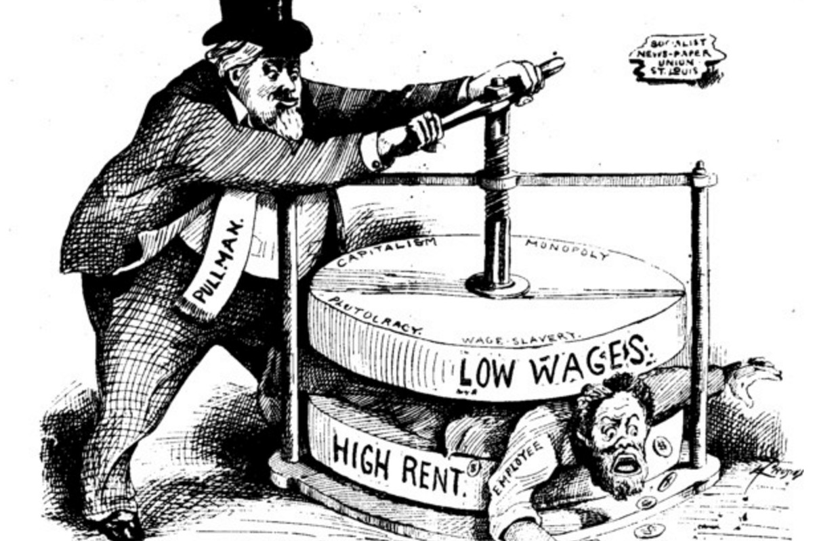

--- 
title: Three Essays on Urban Economics
subtitle: A Prospectus Defense
author: Osman Keshawarz
---

# Introduction

# What do Landlords Do? The Political Economy of Growth and Distribution

# On The Housing Question in San Francisco

# Rent Control Revisited: Is it Good, Actually?

# Conclusion